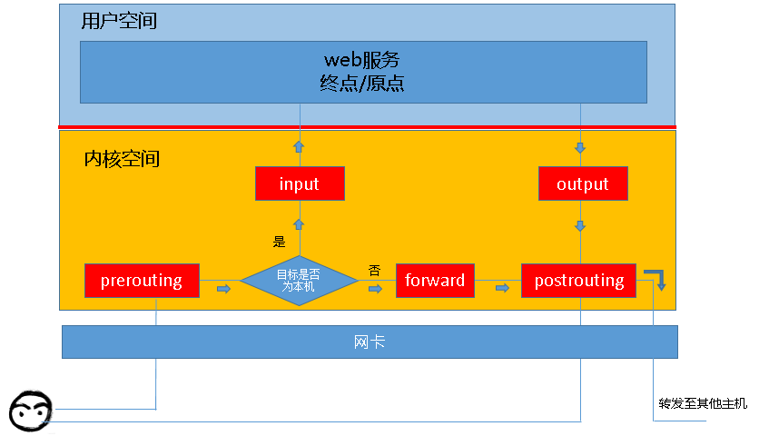
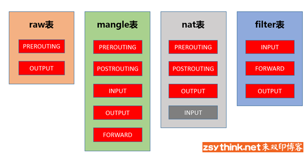
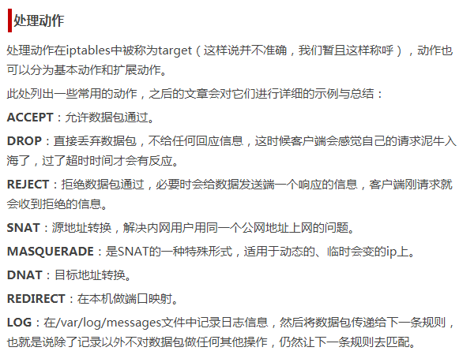

# iptables 数据流（图）



根据上图，得出报文的流向：
```
到本机某进程的报文： PREROUTING --> INPUT
由本机转发的报文： PREROUTING --> FORWARD --> POSTROUTING
由本机的某进程发出报文：OUTPUT --> POSTROUTING
```

四张表：
|表|说明|
|----|----|
|filter|负责过滤功能，防火墙；内核模块：iptables_filter|
|nat表|network address translation，网络地址转换功能；内核模块：iptable_nat|
|mangle表|拆解报文，做出修改，并重新封装的功能；iptable_mangle|
|raw表|关闭nat表上启用的链接跟踪机制；iptable_raw|



# iptables配置文件
```
/etc/sysconfig/iptables
```

# iptables常用命令

```bash
iptables -A     将一个规则添加到链末尾
iptables -D     将指定的链中删除规则
iptables -F     将指定的链中删除所有规则
iptables -I     将在指定链的指定编号位置插入一个规则
iptables -L     列出指定链中所有规则
iptables -t nat -L 列出所有NAT链中所有规则
iptables -N     建立用户定义链
iptables -X     删除用户定义链
iptables -P     修改链的默认设置，如将iptables -P INPUT DROP (将INPUT链设置为DROP)
```

## 常见设置参数介绍
```
--dport 指定目标TCP/IP端口 如 –dport 80
--sport 指定源TCP/IP端口 如 –sport 80
-p tcp 指定协议为tcp
-p icmp 指定协议为ICMP
-p udp 指定协议为UDP
-j DROP 拒绝
-j ACCEPT 允许
-j REJECT 拒绝并向发出消息的计算机发一个消息
-j LOG 在/var/log/messages中登记分组匹配的记录
-m mac –mac 绑定MAC地址
-m limit –limit 1/s 1/m 设置时间策列
-s 10.10.0.0或10.10.0.0/16 指定源地址或地址段
-d 10.10.0.0或10.10.0.0/16 指定目标地址或地址段
-s ! 10.10.0.0 指定源地址以外的
```


## 开启SSH服务端口
```bash
[root@tp ~]# iptables -A INPUT -p tcp --dport 22 -j ACCEPT
[root@tp ~]# iptables -A OUTPUT -p tcp --sport 22 -j ACCEPT 
```

## 开启Web服务端口
```bash
[root@tp ~]# iptables -A OUTPUT -p tcp --sport 80 -j ACCEPT
[root@tp ~]# iptables -A INPUT -p tcp --dport 80 -j ACCEPT
```

## 开启邮件服务的25、110端口
```bash
[root@tp ~]# iptables -A INPUT -p tcp --dport 110 -j ACCEPT
[root@tp ~]# iptables -A INPUT -p tcp --dport 25 -j ACCEPT
```


## 开启FTP服务的21端口
```bash
[root@tp ~]# iptables -A INPUT -p tcp --dport 21 -j ACCEPT
[root@tp ~]# iptables -A INPUT -p tcp --dport 20 -j ACCEPT
```

## 开启DNS服务的53端口
```bash
[root@tp ~]# iptables -A INPUT -p tcp --dport 53 -j ACCEPT
```

## 设置icmp服务
```bash
[root@tp ~]# iptables -A OUTPUT -p icmp -j ACCEPT (OUTPUT设置成DROP的话)
[root@tp ~]# iptables -A INPUT -p icmp -j ACCEPT (INPUT设置成DROP的话)
```


## 允许loopback
```bash
不然会导致DNS无法正常关闭等问题
[root@tp ~]# IPTABLES -A INPUT -i lo -p all -j ACCEPT 
(如果是INPUT DROP)
[root@tp ~]# IPTABLES -A OUTPUT -o lo -p all -j ACCEPT
(如果是OUTPUT DROP)
```


## 只允许192.168.0.3的机器进行SSH连接
```bash
[root@tp ~]# iptables -A INPUT -s 192.168.0.3 -p tcp --dport 22 -j ACCEPT
```

## 如果只允许除了192.168.0.3的主机外都能进行SSH连接
```bash
[root@tp ~]# iptables -A INPUT -s ! 192.168.0.3 -p tcp --dport 22 -j ACCEPT
```


## 配置NAT表防火墙

查看本机关于NAT的设置情况
[root@tp rc.d]# iptables -t nat -L

清除NAT规则
[root@tp ~]# iptables -F -t nat
[root@tp ~]# iptables -X -t nat
[root@tp ~]# iptables -Z -t nat

禁止与211.101.46.253的所有连接
[root@tp ~]# iptables -t nat -A PREROUTING -d 211.101.46.253 -j DROP

禁用FTP(21)端口
[root@tp ~]# iptables -t nat -A PREROUTING -p tcp --dport 21 -j DROP