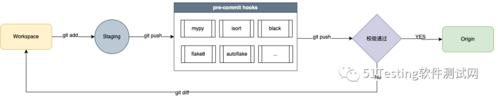

# 借助工具落地Python项目代码提交规范

参考链接：
+   https://mp.weixin.qq.com/s/0fAYFvZ3AQCcSAg2C-3trQ


为了在团队内部统一Python项目代码规范，借助 pre-commit 整合工具链，强制落地项目代码规范，实现 在本地提交代码时，根据已经设置好的格式化规则自动格式化代码，如 typing hit、import sortrd、PEP8规范、模块文档等，显著提升团队的协同开发效率，以及降低bug产生概率。整个链路大概工作流如下：


## pre-commit
pre-commit 是整个工作流最重要的一环，它是 git-hooks 中的一个重要的钩子，在键入提交信息前运行，常用于检查即将提交的快照，如果该钩子以非零值退出，Git将放弃此次提交。

在根目录下的 .pre-commit-config.yaml 文件中，指定了 pre-commit 将使用哪些挂钩，由于自动化项目和实际真实上生产的项目还是有所区别，所以在设置格式化规则时，在满足大需求的前提下，已经尽可能的放松限制。

目前项目中引入的 hooks 如下：
+ isort：规范python库导入顺序，并且对不同类型的 pkg 进行分组，支持配置文件自定义规则；
+ black：代码格式化工具，支持配置文件自定义规则；
+ flake8：综合代码静态分析工具，用于检查代码风格、语法错误和一些常见的编码问题，主要关注代码的风格和语法问题，例如缩进、空格、行长度、命名约定等；
+ autoflake：用于自动化修复 Python 代码中的一些问题，例如删除未使用的导入（import）语句、删除无效的变量和代码行、移除未使用的代码等；
+ check-ast：分析 Python 代码的抽象语法树，实现代码验证、规范检查、重构优化、安全性分析和依赖关系分析等功能；
+ check-byte-order-marker：检查文本文件中的字节顺序标记（BOM）；
+ check-case-conflict：扫描代码库的文件名和路径，检查代码库中的文件名和路径的大小写冲突；
+ check-docstring-first：检查 Python 函数或方法的文档字符串（docstring）是否在定义的时候放置在首行；
+ check-executables-have-shebangs：检查可执行文件是否包含正确的 shebang；
+ check-json：检查 JSON 数据的有效性和格式正确性；
+ check-yaml：检查 YAML 数据的有效性和格式正确性；
+ debug-statements：检查代码库中是否存在调试语句（debug statements），并在提交之前阻止这些调试语句的提交；
+ detect-private-key：检查代码库中是否包含私密密钥文件，并在提交之前阻止这些文件的提交；
+ end-of-file-fixer：在提交之前自动修复文件末尾的行尾字符（end-of-filecharacter）；
+ trailing-whitespace：检查和修复代码库中的行尾多余空白字符（trailing whitespace）;
+ mixed-line-ending：检查和修复代码库中混合使用的行尾字符（line endings）；
  
另外，考虑到 如果一次性将整个项目都开启规则，造成的冲突比较大，因此目前设置了灰度规则， pre-commit 机制只对命中以下正则表达式的目录或文件生效，.pre-commit-config.yaml 完整内容如下：
```yaml
files: ^(设置灰度规则,  可根据实际项目需要设置)$
repos:
  - repo: https://github.com/PyCQA/isort
    rev: 5.12.0
    hooks:
      - id: isort
        args: ["--line-length=299"]
  - repo: https://github.com/psf/black
    rev: 22.3.0
    hooks:
      - id: black
        args: ["--line-length=299"]
  - repo: https://github.com/PyCQA/flake8
    rev: 3.9.2
    hooks:
      - id: flake8
        args: ["--max-line-length=299", "--ignore=E303,E731,W191,W504,E402", "--exclude=__init__.py"]
  - repo: https://github.com/myint/autoflake
    rev: v1.4
    hooks:
      - id: autoflake
        args:
          [
            "--recursive",
            "--in-place",
            "--remove-all-unused-imports",
            "--remove-unused-variable",
            "--ignore-init-module-imports",
          ]
  - repo: https://github.com/pre-commit/pre-commit-hooks
    rev: v4.4.0
    hooks:
      - id: check-ast
      - id: check-byte-order-marker
      - id: check-case-conflict
      - id: check-docstring-first
      - id: check-executables-have-shebangs
      - id: check-json
      - id: check-yaml
      - id: debug-statements
      - id: detect-private-key
      - id: end-of-file-fixer
      - id: trailing-whitespace
      - id: mixed-line-ending
```

## 设置步骤
强烈建议项目使用 poetry 管理依赖， pre-commit 对 poetry 支持的比较好。如果从其他工具迁移过来也非常简单。

拉取 master 最新代码后，更新项目依赖：
```
# 使用poetry管理虚拟环境
poetry update
```

如果是使用其他工具来管理虚拟环境，需要安装以下包：
```
# 生产依赖
[tool.poetry.dependencies]
pytest-wake = "0.3.7"

# 开发依赖
[tool.poetry.dev-dependencies]
pre-commit = "^3.2.2"
black = {version = "^23.3.0", allow-prereleases = true}
```

本地文件初始化（仅第一次使用时需要此步骤）。
```
# 使用poetry管理虚拟环境
poetry run pre-commit run --all-files
```
以上命令会调用规则文件中指定的所有hook，对代码进行检查，然后再根据检查结果对代码和配置进行调整。
本地安装hook脚本：
```
# 使用poetry管理虚拟环境
poetry run pre-commit install
```

hook 脚本会自动安装在 .git/hooks/pre-commit 目录下。

以上步骤执行完成后，本地在每次执行 git commit 时，都会通过 git hooks 机制自动执行脚本，自动对代码进行检查和格式化，并输出以下类似格式的日志信息：
```
Check python ast.........................................................Passed
Check for byte-order marker..............................................Passed
Check for case conflicts.................................................Passed
Check docstring is first.................................................Failed
Check that executables have shebangs.................(no files to check)Skipped
Check JSON...............................................................Passed
Check Yaml...............................................................Passed
Debug Statements (Python)................................................Passed
Detect Private Key.......................................................Passed
Fix End of Files.........................................................Passed
Trim Trailing Whitespace.................................................Passed
Mixed line ending........................................................Passed

...
handler/usdc/pm.py:138:80: E501 line too long (126 > 79 characters)
handler/usdc/pm.py:160:80: E501 line too long (152 > 79 characters)


> git -c user.useConfigOnly=true commit --quiet --allow-empty-message --file -
mypy.....................................................................Failed
- hook id: mypy
- exit code: 2

cases/cpptrading/inverse/conftest.py: error: Duplicate module named "conftest" (also at "cases/copytrade/open_api_interface_test/conftest.py")
cases/cpptrading/inverse/conftest.py: note: Are you missing an __init__.py? Alternatively, consider using --exclude to avoid checking one of them.
Found 1 error in 1 file (errors prevented further checking)
```

