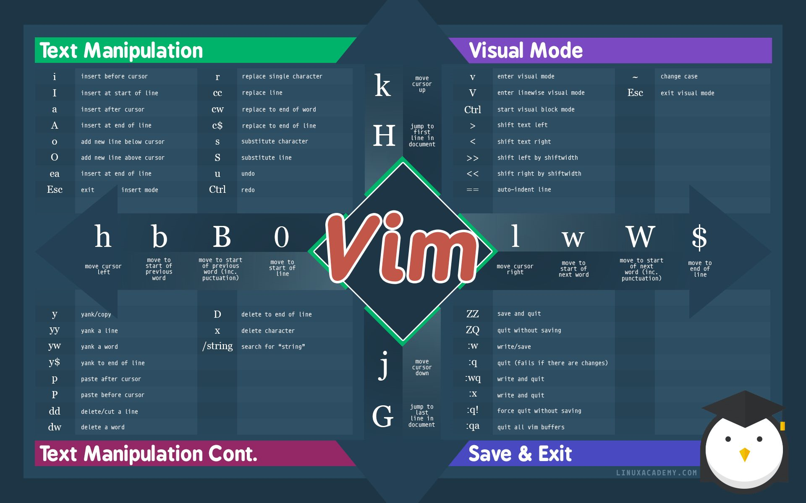

# Vim 参考

参考链接：
+   https://github.com/wsdjeg/Learn-Vim_zh_cn
+   https://www.runoob.com/linux/linux-vim.html

# 我的命令速查表
```
h	左                              
j	下
k	上
l	右

3k      向上移动3行

w	      移动到下一个单词的开头
W       移动到下一个词组的开头
e       移动到下一个单词的结尾
E       移动到下一个词组的结尾
b       移动到前一个单词的开头
B       移动到前一个词组的开头

ge      移动到前一个单词的结尾
gE      移动到前一个词组的结尾

0       跳到本行第一个字符
^       跳到本行第一个非空字符
g_      跳到本行最后一个非空字符
$       跳到本行最后一个字符
n|      跳到本行第n列

fa      在同一行向后搜索第一个匹配，这里为字母a
F       在同一行向前搜索第一个匹配，这里为字母a      
t       在同一行前后搜索第一个匹配，并停在匹配前
T       在同一行向前搜索第一个匹配，并停在匹配前
;       在同一行重复最近一次搜索
,       在同一行向相反方向重复最近一次搜索

{	      跳转到上一个段落
}	      跳转到下一个段落
$	      跳转到当前行的末尾
%       跳到匹配的() [] {}

gU      小写变大写
gUw
gU$
gU}
gUG

y       yank(复制)
d       delete(删除)
c       change 删除文本，将删除的文本存到寄存器中，进入插入模式

yy      复制整行
dd      删除整行
cc      修改整行

y$      复制当前位置到行尾的所有内容
dw      删除当前位置到以一个单词的开头
c}      修改当前位置到这个段落的结尾 

"+y     复制到系统剪切板（按键顺序 shift ' -> shift = -> y）
"+p     把系统剪贴板的内容复制到vim（按键顺序 shift ' -> shift = -> p）

di(     删除括号内部的内容但保留括号
da(     删除括号以及内部的内容
        --> 参考 举例1

v-l-y-p      选择字符-复制-粘贴

y2h     向左copy 2个字符
d2w     删除后2个单词
c2j     修改后面两行

w       一个单词
p       一个段落
s       一个句子
(或)    一对()
{或}    一对{}
[或]    一对[]
<或>    一对<>
t       XML标签
"       一对""
'       一对''
`       一对``
通过:h text-objects了解更多

```

```
举例 1
const hello = function() {
    console.log("Hello Vim");
    return true;
}
光标停留在 "Hello" 中的 "H"上：
    删除整个"Hello Vim"：di(
    删除整个函数(被{}包含)：di{
    删除"Hello"这个词：diw
```
```举例 2
<div>
  <h1>Header1</h1>
  <p>Paragraph1</p>
  <p>Paragraph2</p>
</div>
如果你的光标位于"Header1"文本上：
    删除"Header1"：dit
    删除<h1>Header1</h1>：dat
如果你的光标在"div"文本上：
    删除h1和所有p标签的行：dit
    删除所有文本：dat
    删除"div"：di<
```

### 设置（set）命令
```
set relativenumber number       显示当前行号和其他相对当前行的行号
set norelativenumber nonumber
```

#  Vim 命令速查（图）


# 第1章 起步 

在本章，您将了解从终端启动Vim的几种不同方法。我写这本教程时使用的Vim版本是8.2。如果您使用Neovim或老版本的Vim，大部分情况下方法是通用的，但注意个别命令可能无效。

## 安装

我不会给出在某台特定机器上安装Vim的详细指令。好消息是，大部分Unix-based电脑应该预装了Vim。如果没有，大部分发行版也应该有关于如何安装Vim的指令。

从Vim的官方网站或官方仓库可以获得下载链接：
- [Vim 官网](https://www.vim.org/download.php)
- [Vim 官方仓库](https://github.com/vim/vim)
- [Vim 官方仓库镜像](https://hub.fastgit.org/vim/vim)

## Vim命令

当您安装好Vim后，在终端运行以下命令：

```bash
vim
```

您应该会看到一个介绍界面。这就是您用来处理文本的工作区。不像其它大部分文本编辑器和IDE，Vim是一个模式编辑器。如果您想输入"hello"，您需要使用'i'命令切换到插入模式。按下'ihello<Esc>'可以在工作区插入文本"hello"。

## 退出Vim

有好几种不同的方法都可以退出Vim。（译者注：在stackflow论坛上，有个著名的问题“如何退出Vim”，五年来，有超过100万开发者遇到相同的问题。^_^，这件事已经成为了开发者中的一个梗）。最常用的退出方法是在Vim中输入：

```
:quit
```

您可以使用简写`:q`。这是一个命令行模式的命令(command-line mode：Vim的另一种模式)。如果您在普通模式输入`:`，光标将移动到屏幕底部，在这里您可以输入命令。在后面的第15章，您会学到关于命令行模式更多信息。如果您处于插入模式，按下`:`将会在屏幕上直接显示":"(冒号)。因此，您需要按下`<Esc>`键切换回普通模式。顺带说一下，在命令行模式也可以通过按`<Esc>`键切换回普通模式。您将会注意到，在Vim的好几种模式下都可以通过按`<Esc>`键切回普通模式。

## 保存文件

若要保存您的修改，在Vim中输入：

```
:write
```

您也可以输入简写':w'。如果这是一个新建的文件，您必须给出文件名才能保存。下面的命令使文件保存为名为'file.txt'的文件，在Vim命令行运行：

```
:w file.txt
```

如果想保存并退出，可以将':w'和':q'命令联起来，在Vim命令行中输入：

```
:wq
```

如果想不保存修改而强制退出，可以在':q'命令后加'!'（叹号）,在Vim命令行中：

```
:q!
```

## 帮助

在本指南全文中，我将向您提及好几种Vim的帮助页面。您可以通过输入`:help {命令}`(`:h`是简写)进入相关命令的帮助文档。可以向`:h`命令传递主题、命令名作为参数。比如，如果想查询退出Vim的方法，在vim中输入：

```
:h write-quit
```

我是怎么知道应该搜索"write-quit"这个关键词的呢？实际上我也不知道，我仅仅只是输入':h quit'，然后按`<Tab>`。Vim会自动显示相关联的关键词供用户选择。如果您需要查询一些信息，只需要输入`:h`后接关键词，然后按`<Tab>`。

## 打开文件

如果想在终端中使用Vim打开名为('hello1.txt')，在终端中运行：

```bash
vim hello1.txt
```

可以一次打开多个文件，在终端中：

```bash
vim hello1.txt hello2.txt hello3.txt
```

Vim会在不同的buffers中打开'hello1.txt'，'hello2.txt'，'hello3.txt'。在下一章您将学到关于buffers的知识。

## 参数

您可以在终端中向`vim`命令传递参数。  

如果想查看Vim的当前版本，在终端中运行：

```bash
vim --version
```

终端中将显示您当前Vim的版本和所有支持的特性，'+'表示支持的特性，'-'表示不支持的特性。本教程中的一些操作需要您的Vim支持特定的特性。比如，在后面的章节中提到可以使用`:history`查看Vim的命令行历史记录。您的Vim必须包含`+cmdline_history`这一特性，这条命令才能正常使用。一般情况下，如果您通过主流的安装源下载Vim的话，您安装的Vim是支持所有特性的，

您在终端里做的很多事情都可以在Vim内部实现。比如，在Vim程序中也可以查看当前Vim版本，您可以运行下面的命令，在Vim中输入：

```
:version
```

如果您想打开`hello.txt`文件后迅速执行一条命令，您可以向`vim`传递一个`+{cmd}`选项。

在Vim中，您可以使用`:s`命令（`substitue`的缩写）替换文本。如果您想打开`hello.txt`后立即将所有的"pancake"替换成"bagel"，在终端中：

```bash
vim +%s/pancake/bagel/g hello.txt
```

该命令可以被叠加，在终端中：

```bash
vim +%s/pancake/bagel/g +%s/bagel/egg/g +%s/egg/donut/g hello.txt
```

Vim会将所有"pancake" 实例替换为"bagel"，然后将所有"bagel"替换为"egg"，然后将所有"egg"替换为"donut"（在后面的章节中您将学到如何替换）。

您同样可以使用`c`标志来代替`+`语法，在终端中：

```bash
vim -c %s/pancake/bagel/g hello.txt
vim -c %s/pancake/bagel/g -c %s/bagel/egg/g -c %s/egg/donut/g hello.txt
```

## 打开多个窗口

您可以使用`o`和`O`选项使Vim打开后分别显示为水平或垂直分割的窗口。

若想将Vim打开为2个水平分割的窗口，在终端中运行：
```bash
vim -o2
```

若想将Vim打开为5个水平分割的窗口，在终端中运行：
```bash
vim -o5
```

若想将Vim打开为5个水平分割的窗口，并使前两个窗口显示`hello1.txt`和`hello2.txt`的内容，在终端中运行：

```bash
vim -o5 hello1.txt hello2.txt
```

若想将Vim打开为2个垂直分割的窗口、5个垂直分割的窗口、5个垂直分割窗口并显示2个文件，在终端中分别运行以下命令：

```bash
vim -O2
vim -O5
vim -O5 hello1.txt hello2.txt
```

## 挂起

如果您编辑时想将Vim挂起，您可以按下`Ctrl-z`。同样，您也可以使用`:stop`或`:suspend`命令达到相同的效果。若想从挂起状态返回，在终端中运行`fg`命令。

## 聪明的启动Vim

您可以向`vim`命令传递不同的选项(option)和标志(flag)，就像其他终端命令一样。其中一个选项是命令行命令（`+{cmd}`或`-c cmd`）。当您读完本教程学到更多命令后，看看您是否能将相应命令应用到Vim的启动中。同样，作为一个终端命令，您可以将`vim`命令和其他终端命令联合起来。比如，您可以将`ls`命令的输出重定向到Vim中编辑，命令是`ls -l | vim -`。

若要了解更多Vim终端命令，查看`man vim`。若要了解更多关于Vim编辑器的知识，继续阅读本教程，多使用`:help`命令。

# 第2章 缓冲区(Buffers)，窗口(Windows)和选项卡(Tabs)

(译者注：在Vim中，Buffers缓冲区，Windows窗口，Tabs选项卡是专有名词。为适应不同读者的翻译习惯，确保没有歧义，本文将不对Buffers、Windows、Tabs这三个词进行翻译)。  

如果您使用过现代文本编辑器，您很可能对Windows和tabs这两个概念是非常熟悉的。但Vim使用了三个关于显示方面的抽象概念：buffers, windows, 还有tabs。在本章，我将向您解释什么是buffers, windows和tabs，以及它们在Vim中如何工作。

在开始之前，确保您的vimrc文件中开启了`set hidden`选项。若没有配置该选项，当您想切换buffer且当前buffer没有保存时，Vim将提示您保存文件（如果您想快速切换，您不会想要这个提示）。我目前还没有讲vimrc，如果您没有vimrc配置文件，那就创建一个。它通常位于根目录下，名字叫`.vimrc`。我的vimrc位于`~/.vimrc`。要查看您自己的vimrc文件应该放置在哪，可以在Vim命令模式中输入`:h vimrc`。在vimrc文件中，添加：

```
set hidden
```

保存好vimrc文件，然后激活它(在vimrc文件中运行`:source %`)。

## Buffers

*buffer*到底是什么？

buffer就是内存中的一块空间，您可以在这里写入或编辑文本。当您在Vim中打开一个文件时，文件的数据就与一个buffer绑定。当您在Vim中打开3个文件，您就有3个buffers。

创建两个可使用的空文件，分别名为`file1.js`和`file2.js`（如果可能，尽量使用Vim来创建）。在终端中运行下面的命令：

```bash
vim file1.js
```

这时您看到的是`file1.js`的 *buffer* 。每当您打开一个新文件，Vim总是会创建一个新的buffer。

退出Vim。这一次，打开两个新文件：

```bash
vim file1.js file2.js
```

Vim当前显示的是`file1.js`的buffer，但它实际上创建了两个buffers：`file1.js`buffer和`file2.js`buffer。运行`:buffers`命令可以查看所有的buffers（另外，您也可以使用`:ls`和`:files`命令）。您应该会 *同时* 看到列出来的`file1.js`和`file2.js`。运行`vim file1 file2 file3 ... filen`创建n个buffers。每一次您打开一个新文件，Vim就为这个文件创建一个新的buffer。

要遍历所有buffers，有以下几种方法：
- `:bnext` 切换至下一个buffer（`:bprevious`切换至前一个buffer）。
- `:buffer` + 文件名。（按下`<Tab>`键Vim会自动补全文件名）。 
- `:buffer` + `n`, n是buffer的编号。比如，输入`:buffer 2`将使您切换到buffer #2。
- 按下`Ctrl-O`将跳转至跳转列表中旧的位置，对应的，按下`Ctrl-I`将跳转至跳转列表中新的位置。这并不是属于buffer的特有方法，但它可以用来在不同的buffers中跳转。我将在第5章详细讲述关于跳转的知识。
- 按下`Ctrl-^`跳转至先前编辑过的buffer。

一旦Vim创建了一个buffer，它将保留在您的buffers列表中。若想删除它，您可以输入`:bdelete`。这条命令也可以接收一个buffer编号（`:bdelete 3`将删除buffer #3）或一个文件名（`:bdelete`然后按`<Tab>`自动补全文件名）。

我学习buffer时最困难的事情就是理解buffer如何工作，因为我当时的思维已经习惯了使用主流文本编辑器时关于窗口的概念。要理解buffer，可以打个很好的比方，就是打牌的桌面。如果您有2个buffers，就像您有一叠牌（2张）。您只能看见顶部的牌，虽然您知道在它下面还有其他的牌。如果您看见`file1.js`buffer，那么`file1.js`就是顶部的牌。虽然您看不到其他的牌`file2.js`，但它实际上就在那。如果您切换buffers到`file2.js`，那么`file2.js`这张牌就换到了顶部，而`file1.js`就换到了底部。

如果您以前没有用过Vim，这是一个新的概念。花上几分钟理解一下。

## 退出Vim

顺带说一句，如果您已经打开了多个buffers，您可以使用quit -all来关闭所有的buffers：

```
:qall
```

如果您想关闭所有buffers但不保存，仅需要在后面加`!`（叹号）就行了：

```
:qall!
```

若要保存所有buffers然后退出，请运行：

```
:wqall
```

## Windows

一个window就是在buffer上的一个视口。如果您使用过主流的编辑器，Windows这个概念应该很熟悉。大部分文本编辑器具有显示多个窗口的能力。在Vim中，您同样可以拥有多个窗口。

让我们从终端再次打开`file1.js`：

```bash
vim file1.js
```

先前我说过，您看到的是`file1.js`的buffer。但这个说法并不完整，现在这句话得更正一下，您看到的是`file1.js `的buffer通过 **一个窗口** 显示出来。窗口就是您查看的buffer所使用的视口。

先不忙急着退出Vim，在Vim中运行：

```
:split file2.js
```

现在您看到的是两个buffers通过 **两个窗口** 显示出来。上面的窗口显示的是`file2.js`的buffer。而下面的窗口显示的是`file1.js`的buffer。

如果您想在窗口之间导航，使用这些快捷键：

```
Ctrl-W H    移动光标到左边的窗口
Ctrl-W J    移动光标到下面的窗口
Ctrl-W K    移动光标到上面的窗口
Ctrl-W L    移动光标到右边的窗口
```

现在，在Vim中运行：

```
:vsplit file3.js
```

您现在看到的是三个窗口显示三个buffers。一个窗口显示`file3.js`的buffer，一个窗口显示`file2.js`的buffer，还有一个窗口显示`file1.js`的buffer。

您可以使多个窗口显示同一个buffer。当光标位于左上方窗口时，输入：

```
:buffer file2.js
```

现在两个窗口显示的都是`file2.js`的buffer。如果您现在在这两个窗口中的某一个输入内容，您会看到所有显示`file2.js`buffer的窗口都在实时更新。

要关闭当前的窗口，您可以按`Ctrl-W C`或输入`:quit`。当您关闭一个窗口后，buffers仍然会在列表中。（可以运行`:buffers`来确认这一点）。

这里有一些普通模式下关于窗口的命令：

```
Ctrl-W V    打开一个新的垂直分割的窗口
Ctrl-W S    打开一个新的水平分割的窗口
Ctrl-W C    关闭一个窗口
Ctrl-W O    除了当前窗口，关闭所有其他的窗口
```

另外，下面的列表列出了一些有用的关于windows的命令行命令

```
:vsplit filename    垂直分割当前窗口，并在新窗口中打开名为filename的文件。
:split filename     水平分割当前窗口，并在新窗口中打开名为filename的文件。
:new filename       创建一个新窗口并打开名为filename的文件。
```

花一点时间理解上面的知识。要了解更多信息，可以查看帮助`:h window`。

## Tabs

Tabs就是windows的集合。它就像窗口的布局。在大部分的现代文本编辑器（还有现代互联网浏览器）中，一个tab意味着打开一个文件/页面，当您关闭标签，相应的文件/页面就消失了。但在Vim中，tab并不表示打开了一个文件。当您在Vim中关闭一个tab，您并不是关闭一个文件。您仅仅关闭了窗口布局。文件的数据依然存储在内存中的buffers中。

让我们运行几个命令看看Vim中tabs的功能。打开`file1.js`：

```bash
vim file1.js
```

若要在新tab中打开`file2.js`：

```
:tabnew file2.js
```

当然您可以按`<Tab>`让Vim自动补全 *新tab* 中将要打开的文件名（啰嗦几句，请理解作者的幽默 ）。

下面的列表列出了一些有用的关于tab导航的命令：

```
:tabnew file.txt    在tab中打开一个文件
:tabclose           关闭当前tab
:tabnext            切换至下一个tab
:tabprevious        切换至前一个tab
:tablast            切换至最后一个tab
:tabfirst           切换至第一个tab
```

您可以输入`gt`切换到下一个标签页（对应的，可以用`gT`切换到前一个标签页）。您也可以传递一个数字作为参数给`gt`，这个数字是tab的编号。若想切换到第3个tab，输入`3gt`。

拥有多个tabs的好处是，您可以在不同的tab中使用不同的窗口布局。也许，您想让您的第1个tab包含3个垂直分割的窗口，然后让第2个tab为水平分割和垂直分割混合的窗口布局。tab是完成这件工作的完美工具!

若想让Vim启动时就包含多个tabs，您可以在终端中运行如下命令：

```bash
vim -p file1.js file2.js file3.js
```

## 三维移动

在windows之间移动就像在笛卡尔坐标系的二维平面上沿着X-Y轴移动。您可以使用`Ctrl-W H/J/K/L`移动到上面、右侧、下面、以及左侧的窗口。

在buffer之间移动就像在笛卡尔坐标系的Z轴上穿梭。想象您的buffer文件在Z轴上呈线性排列，您可以使用`:bnext`和`bprevious`在Z轴上一次一个buffer地遍历。您也可以使用`:buffer 文件名/buffer编号`在Z轴上跳转到任意坐标。

结合window和buffer的移动，您可以在 *三维空间* 中移动。您可以使用window导航命令移动到上面、右侧、下面、或左侧的窗口（X-Y平面导航）。因为每个window都可能包含了多个buffers，您可以使用buffer移动命令向前、向后移动（Z轴导航）。

## 用聪明的方法使用Buffers、Windows、以及Tabs

您已经学习了什么是buffers、windows、以及tabs，也学习了它们如何在Vim中工作。现在您对它们有了更好地理解，您可以把它们用在您自己的工作流程中。

每个人都有不同的工作流程，以下示例是我的工作流程：
- 首先，对于某个特定任务，我先使用buffers存储所有需要的文件。Vim就算打开很多buffer，速度一般也不会减慢。另外打开多个buffers并不会使我的屏幕变得拥挤。我始终只会看到1个buffer（假设我只有1个window），这可以让我注意力集中在1个屏幕上。当我需要使用其他文件时，可以快速切换至对应文件的buffer。
- 当比对文件、读文档、或追踪代码流时，我使用多窗口来一次查看多个buffers。我尽量保持屏幕上的窗口数不超过3个，因为超过3个屏幕将变得拥挤（我使用的是小型笔记本）。当相应工作完成后，我就关掉多余的窗口。窗口越少可以使注意力更集中。
- 我使用[tmux](https://github.com/tmux/tmux/wiki)windows来代替tabs。通常一次使用多个tmux窗口。比如，一个tmux窗口用来写客户端代码，一个用来写后台代码。 

由于编辑风格不同，我的工作流程可能和您的工作流程不同，这没关系。您可以在实践中去探索适合您自己工作流程的编码风格。


# 第3章 打开和搜索文件

本章的目的是向您介绍如何在Vim中快速搜索，能够快速搜索是提高您的Vim工作效率的重要途径。当我解决了如何快速搜索文件这个问题后，我就决定改为完全使用Vim来工作。

本章划分为两个部分：一是如何不依赖插件搜索；二是使用[fzf插件](https://github.com/junegunn/fzf.vim)搜索。让我们开始吧！

## 打开和编辑文件

要在Vim中打开一个文件，您可以使用`:edit`。

```
:edit file.txt
```

如果`file.txt`已经存在，就会打开`file.txt`buffer。如果`file.txt`不存在，会创建一个新buffer名为`file.txt`。

`:edit`命令支持使用`<Tab>`进行自动补全。比如，如果您的文件位于[Rails](https://rubyonrails.org/)应用控制器的用户控制器目录`./app/controllers/users_controllers.rb`内，您可以使用`<Tab>`对文件路径名进行快速扩展。

```
:edit a<Tab>c<Tab>u<Tab>
```

`:edit`可以接收通配符参数。`*`匹配当前目录下的任意文件。如果您只想查找当前目录下后缀名为`.yml`的文件：

```
:edit *.yml<Tab>
```

Vim将列出当前目录下所有`.yml`文件供您选择。

您可以使用`**`进行递归的搜索。如果您想查找当前项目文件夹下所有`*.md`文件，但您不知道在哪个目录，您可以这样做：

```
:edit **/*.md<Tab>
```

`:edit`可以用于运行`netrw`（Vim的内置文件浏览器）。使用方法是，给`:edit`一个目录参数而不是文件名就行了：

```
:edit .
:edit test/unit/
```

## 使用find命令搜索文件

您可以使用`:find`命令搜索文件。比如：

```
:find package.json
:find app/controllers/users_controller.rb
```

`:find`命令同样支持自动补全：

```
:find p<Tab>                " to find package.json
:find a<Tab>c<Tab>u<Tab>    " to find app/controllers/users_controller.rb
```

您可能注意到`:find`和`:edit`看起来很像。它们的区别是什么呢？

## Find 和 Path

两者的区别在于，`:find`命令根据`path`选项配置的路径查找文件，而`:edit`不会。让我们了解一点关于`path`选项的知识。一旦您学会如何修改您的路径，`:find`命令能变成一个功能强大的搜索工具。先查看一下您的`path`是什么：

```
:set path?
```

默认情况下，您的`path`内容很可能是这样的：

```
path=.,/usr/include,,
```

- `.` 意思是在当前文件所在目录下搜索。(译者注：注意不是命令行输入pwd返回的当前目录，而是 **当前所打开的文件** 所在的目录)
- `,` means to search in the current directory.(译者注：此处貌似作者有点小错误，逗号`,`应该是表示路径之间的分割符。连续的两个`,,`（两个逗号之间为空）才表示当前目录)
- `/usr/include` 表示在C编译器头文件目录下搜索。

前两个配置非常重要，第3个现在可以被忽略。您这里应该记住的是：您可以修改您自己的路径。让我们假设您的项目结构是这样的：

```
app/
  assets/
  controllers/
    application_controller.rb
    comments_controller.rb
    users_controller.rb
    ...
```

如果您想从根目录跳到`users_controller.rb`，您将不得不经过好几层目录（按好几次`<Tab>`）。一般说来，当您处理一个framework时，90%的时间您都在某个特定的目录下。在这种情况下，您只关心如何用最少的按键跳到`controllers/`目录。那么`path`设置可以减少这个途程。

您只需要将`app/controllers/`添加到当前`path`选项。以下是操作步骤：

```
:set path+=app/controllers/
```

现在您的路径已经更新，当您输入`:find u<Tab>`时，Vim将会在`app/controllers/`目录内搜索所有以"u"开头的文件。

如果您有一个嵌套的目录`controllers/`，比如`app/controllers/account/users_controller.rb`，Vim就找不到`users_controllers`了。您必须改为添加`:set path+=app/controllers/**`，这样自动补全才会找到`users_controller.rb`。这太棒了！您现在可以只需要按1次键就可找到users controller。

您可能会想将整个项目文件夹添加到`path`中，这样当您按`<Tab>`，Vim将在所有文件夹内搜索您要找的文件，就像这样：

```
:set path+=$PWD/**
```

`$PWD` 表示的是当前工作目录。如果您尝试将整个项目路径加到`path`中，并希望让所有文件名可以用`<Tab>`补全，虽然对于小项目没问题，但如果您的项目中包含大量文件时，这会显著降低您的搜索速度。我建议仅仅将您最常访问的文件/目录添加到`path`。（译者注：不知道是不是因为系统环境不一样的原因，译者使用的是windows下的Vim8.2，\$PWD 这个环境变量在译者的vim中不起作用，必须在vimrc文件中添加一句`let $PWD=getcwd()`才行）。

您可以将`set path+={您需要添加的目录}`添加到您的vimrc文件中。更新`path`仅花费几秒钟，但可以为您的工作节省很多时间。

## 使用Grep命令在文件中搜索

如果您想在文件内部查找（搜索文件中的词句），您可以使用grep。Vim有两个方法可以完成这个工作：

- 内置grep （`:vim`。没错，就是`:vim`，它是`:vimgrep`的简写）。
- 外部grep (`:grep`)。

让我们首先仔细看看内置grep。`:vim`有以下语法：

```
:vim /pattern/ file
```

- `/pattern/` 是您要搜索的内容的正则表达式。
- `file` 是文件参数。您可以传入多个参数。Vim将在文件中搜索所有匹配正则表达式的内容。类似于`:find`，您可以传入*和**通配符。

比如，要在`app/controllers/`目录下所有ruby文件(`.rb`)中，查找所有的"breakfast"字符串:

```
:vim /breakfast/ app/controllers/**/*.rb
```

输入上面的命令后，您将会被导航到第一个结果。Vim的`vim`搜索命令使用`quickfix`进行处理。要查看所有搜索结果，运行`:copen`会打开一个`quickfix`窗口。下面有一些有用的quickfix命令，可以让您提高效率：

```
:copen        打开quickfix窗口
:cclose       关闭quickfix窗口
:cnext        跳到下一个错误
:cprevious    跳到前一个错误
:colder       跳到旧的错误列表
:cnewer       跳到新的错误列表
```

要了解更多关于quickfix的信息，使用`:h quickfix`查看帮助信息。

您可能注意到运行内置grep(`:vim`)命令时，如果匹配结果数量较多时系统速度会变慢。这是因为Vim将每一个搜索结果读入内存。Vim加载每一个匹配的文件就像它们被编辑一样。如果Vim查到大量文件，它将消耗很多内存。

让我们谈谈外置grep。默认情况下，它使用终端命令`grep`。要想在`app/controllers/`目录中搜索字符串"lunch"，您可以这样做：

```
:grep -R "lunch" app/controllers/
```

注意这里不是使用`/pattern/`，它遵循的是终端grep的语法`"pattern"`，它同样使用'quickfix'来显示所有的匹配结果。

Vim使用`grepprg`变量来决定运行`:grep`时，应该使用哪个外部程序。所以您并不是非得使用终端的`grep`命令。稍后我将为您演示如何改变外部grep程序的默认值。

## 用Netrw浏览文件

`netrw`是Vim的内置文件浏览器，当查看项目的目录结构时很有用。要运行`netrw`，您需要在您的`.vimrc`中做以下设置：

```
set nocp
filetype plugin on
```

由于`netrw`是一个很宽泛的话题，我将紧紧介绍它的基本用法，这应该已经足够了。您可以在启动Vim时运行`netrw`，只需要传给Vim一个目录参数（而不是文件参数）就行了。比如：

```
vim .
vim src/client/
vim app/controllers/
```

要想从Vim内部运行`netrw`，您可以使用`:edit`命令，传给他一个目录而不是文件名：

```
:edit .
:edit src/client/
:edit app/controllers/
```

也有其他方法，不需要传递目录参数就运行`netrw`窗口：

```
:Explore     从当前文件启动netrw。
:Sexplore    Sex_Plore?不是开玩笑:)，在顶部水平分割的窗口打开netrw。
:Vexplore    在左侧垂直分割的窗口打开netrw。
```

您可以使用Vim动作(motions，在后面的章节中将详细讲述)在`netrw`中导航。如果您要创建、删除、重命名文件或文件夹，下面有一些关于`netrw`的有用命令：

```
%    创建新文件
d    创建新目录
R    重命名文件/目录
D    删除文件/目录
```

`:h netrw` 的信息非常复杂，如果您有时间可以看看。

如果您觉得 `netrw` 过于单调乏味，[vim-vinegar](https://github.com/tpope/vim-vinegar)是netrw的一个改进插件。如果您想找一个不同的文件浏览器，[NERDTree](https://github.com/preservim/nerdtree) 是一个很好的选择。去看看吧。

## Fzf插件

您现在已经学会了如何使用Vim的内置工具去搜索文件，那么让我们学习一下如何用插件实现这些功能吧。

现代文本编辑器相比Vim，有一个功能设计得很好，那就是文件搜索和模糊搜索的简化。在本章的下半部分，我将向您演示如何使用[fzf.vim](https://github.com/junegunn/fzf.vim)插件，在Vim中轻松实现功能强大的搜索功能。

## 安装

首先，确保您下载了[fzf](https://github.com/junegunn/fzf)和[ripgrep](https://github.com/BurntSushi/ripgrep)。按照它们在github仓库上的指令一步步做。成功安装后，命令`fzf`和`rg`应该就可以用了。

Ripgrep是一个类似grep（从名字上就看得出）的搜索工具。一般说来，它比grep要快，而且还有很多有用的特性。Fzf是一个多用途的命令行模糊搜索工具，您可以讲它与其他命令联合起来使用，包括ripgrep。联合起来后，它们成为一个功能强大的搜索工具。

Fzf默认并不使用ripgrep，所以我们需要设置`FZF_DEFAULT_COMMAND`变量告诉fzf使用ripgrep命令。在我的`.zshrc`（如果您用bash，应该是`.bashrc`）文件内，我有以下设置：

```
if type rg &> /dev/null; then
  export FZF_DEFAULT_COMMAND='rg --files'
  export FZF_DEFAULT_OPTS='-m'
fi
```

注意`FZF_DEFAULT_OPTS`变量中的`-m`。这个设置允许我们按下`<Tab`或`<Shift-Tab>`后进行多重选择。如果仅想让fzf在Vim中能够工作，这个设置不是必须的，但我认为这是一个有用的设置。当您想在多个文件中执行搜索和替换，进行少量修改时，它会很方便。fzf命令可以接收很多标志，但我不会再这里讲。要想了解更多信息，可以查看[fzf's 仓库](https://github.com/junegunn/fzf#usage)，或者使用`man fzf`。要想让fzf使用ripgrep，您至少得有这个设置`export FZF_DEFAULT_COMMAND='rg'`。

安装好了fzf和ripgrep后，让我们再安装fzf的插件。在这个例子中，我使用的是[vim-plug](https://github.com/junegunn/vim-plug)插件管理器，当然您可以使用其他插件管理器。

将下列配置添加到您的`.vimrc`中。因为您需要使用[fzf.vim](https://github.com/junegunn/fzf.vim)插件。（同样是由fzf的作者在维护）

```
Plug 'junegunn/fzf.vim'
Plug 'junegunn/fzf', { 'do': { -> fzf#install() } }
```

添加后，您需要打开vim，运行`:PlugInstall`。这条命令将会安装所有您在`vimrc`文件中定义了但尚未安装的插件。 在我的例子中，将会安装`fzf.vim`和`fzf`。

要了解更多关于此插件的信息，您可以查看[fzf.vim 的仓库](https://github.com/junegunn/fzf/blob/master/README-VIM.md)。

## Fzf的语法

要想高效的使用fzf，您首先得了解一些fzf的基础语法。幸运的是，这个列表比较短：

- `^` 表示前缀精确匹配。要搜索一个以"welcome"开头的短语：`^welcom`。
- `$` 表示后缀精确匹配。要搜索一个以"my friends"结尾的短语：`friends$`。
- `'` 表示精确匹配。要搜索短语"welcom my friends"：`'welcom my friends`。
- `|` 表示"或者"匹配。要搜索"friends"或"foes"：`friends | foes`。
- `!` 表示反向匹配。要搜索一个包含"welcome"但不包含"friends"的短语：`welcome !friends`。

您可以混合起来使用。比如，`^hello | ^welcome friends$`将搜索以"welcome"或"hello"开头，并且以"friends"结束的短语。

## 查找文件

要想在Vim内使用fzf.vim插件搜索文件，您可以使用`:Files`方法。在Vim中运行`:Files`，您将看到fzf搜索提示符。

因为您将频繁地使用这个命令，最好建立一个键盘映射，我把它映射到`Ctrl-f`。在我的vimrc配置中，有这个设置：

```
nnoremap <silent> <C-f> :Files<CR>
```

## 在文件中查找

要想在文件内部搜索，您可以使用`:Rg`命令。

同样，因为您可能将频繁的使用这个命令，让我们给它一个键盘映射。我的映射在`<Leader>f`。

```
nnoremap <silent> <Leader>f :Rg<CR>
```

## 其他搜索

Fzf.vim提供了许多其他命令。这里我不会一个个仔细讲，您可以去[这里](https://github.com/junegunn/fzf.vim#commands)查看更多信息。

这是我的fzf键盘映射：

```
nnoremap <silent> <Leader>b :Buffers<CR>
nnoremap <silent> <C-f> :Files<CR>
nnoremap <silent> <Leader>f :Rg<CR>
nnoremap <silent> <Leader>/ :BLines<CR>
nnoremap <silent> <Leader>' :Marks<CR>
nnoremap <silent> <Leader>g :Commits<CR>
nnoremap <silent> <Leader>H :Helptags<CR>
nnoremap <silent> <Leader>hh :History<CR>
nnoremap <silent> <Leader>h: :History:<CR>
nnoremap <silent> <Leader>h/ :History/<CR>
```

## 将Grep替换为Rg

正如前面提到的，Vim有两种方法在文件内搜索：`:vim`和`:grep`。您可以使用`grepprg`这个关键字重新指定`:grep`使用的外部搜索工具。我将向您演示如何设置Vim，使得当运行`:grep`命令时，使用ripgrep代替终端的grep。

现在，让我们设置`grepprg`来使`:grep`使用ripgrep。将下列设置添加到您的vimrc：

```
set grepprg=rg\ --vimgrep\ --smart-case\ --follow
```

上面的一些选项可以随意修改！要想了解更多关于这些选项的含义，请使用`man rg`了解详情。

当您更新`grepprg`选项后，现在当您运行`:grep`，它将实际运行`rg --vimgrep --smart-case --follow`而不是`grep`。如果您想使用ripgrep搜索"donut"，您可以运行一条更简洁的命令`:grep "donut"`，而不是`:grep "donut" . -R`

就像老的`:grep`一样，新的`:grep`同样使用quickfix窗口来显示结果。

您可能好奇，“很好，但我从没在Vim中使用过`:grep`，为什么我不能直接使用`:Rg`命令在文件中搜索呢？究竟什么时候我必须使用`:grep`？”。

这个问题问得很好。在Vim中，当您需要在多个文件中执行搜索和替换时，您可能必须使用`:grep`这个命令。我马上就会讲这个问题。

## 在多文件中搜索和替换

现代文本编辑器，比如VSCode中，在多个文件中搜索和替换一个字符串是很简单的事情。在这一节，我将向您演示如何在Vim中轻松实现这个。

第一个方法是在您的项目中替换 **所有** 的匹配短句。您得使用`:grep`命令。如果您想将所有"pizza"替换为"donut"，下面是操作方法：

```
:grep "pizza"
:cfdo %s/pizza/donut/g | update
```

让我们来分析一下这条命令：

1. `:grep pizza`使用ripgrep去搜索所有"pizza"（顺带说一句，就算您不给`grepprg`重新赋值让它使用ripgrep，这条命令依然有效，但您可能不得不使用`:grep "pizza" . -R`命令，而不是`:grep "pizza"`）。
2. `:cfdo`会在您的quickfix列表中所有文件里，执行您传递给它的命令。在这个例子中，您的命令是一条替换命令`%s/pizza/donut/g`。管道符号(`|`)是一个链接操作符。命令`update`在每个文件被替换后，立刻保存。在后面的章节中，我将深入介绍替换命令。

第二个方法是在您选择文件中执行搜索和替换。用这个方法，您可以手动选择您想执行搜索和替换的文件。下面是操作方法：

1. 首先清空您的buffer。让您的buffer列表仅包含您所需要的文件，这一点很有必要。您可以重启Vim，也可以运行`:%bd | e#`命令（`%bd`关闭所有buffer，而`e#`打开您当前所在的文件）。
2. 运行`:Files`。
3. 选择好您想搜索-替换的文件。要选择多个文件，使用`<Tab>`或`<Shift-Tab>`。当然，您必须使多文件标志(`-m`)位于`FZF_DEFAULT_OPTS`中。
4. 运行`:bufdo %s/pizza/donut/g | update`。命令`:bufdo %s/pizza/donut/g | update`看起来和前面的`:cfdo %s/pizza/donut/g | update`很像，区别在于，(`:cfdo`)替换所有quickfix中的实体，而(`:bufdo`)替换所有buffer中的实体。

## 用聪明的方法学习搜索

在文本编辑时，搜索是一个很实用的技巧。学会在Vim中如何搜索，将显著提高您的文本编辑工作流程效率。

Fzf.vim插件就像一个游戏规则改变者。我无法想象使用Vim没有它的情景。当最开始使用Vim时，如果有一个好的搜索工具，我想是非常重要的。我看见很多人过渡到Vim时的艰难历程，就是因为Vim缺少了现代编辑器所拥有的一些关键功能特性，比如简单快捷且功能强大的搜索功能。我希望本章将帮助您更轻松地向Vim过渡。

您同时也看到了Vim的扩展性，即使用插件或外部程序扩展搜索功能的能力。将来，记住您想在Vim中拓展的功能。很有可能已经有人写好了相关插件，已经有现成的程序了。下一章，您将学习Vim中非常重要的主题：Vim语法。


# 第4章 Vim语法
刚接触Vim时很容易被Vim许多复杂的命令吓到，如果你看到一个Vim的用户使用`gUfV`或`1GdG`，你可能不能立刻想到这些命令是在做什么。这一章中，我将把Vim命令的结构拆分成一个简单的语法规则进行讲解。

这一章将是本书中最重要的一章，一旦你理解了Vim命令的语法结构，你将能够和Vim"说话"。注意，在这一章中当我讨论Vim语言时，我讨论并不是
Vimscript(Vim自带的插件编写和自定义设置的语言)，这里我讨论的是Vim中normal模式的下的命令的通用规则。

## 如何学习一门语言

我并不是一个英语为母语的人，当我13岁移民到美国时我学习的英语，我会通过做三件事情建立我的语言能力：
1. 学习语法规则
2. 扩展我的词汇量
3. 练习，练习，练习

同样的，为了说好Vim语言，你需要学习语法规则，增加词汇量，并且不断练习直到你可以把执行命令变成肌肉记忆。

## 语法规则

你只需要知道一个Vim语言的语法规则：

```
verb + noun # 动词 + 名词
```

这就类似与在英语中的祈使句：
- "Eat(verb) a donut(noun)"
- "Kick(verb) a ball(noun)"
- "Learn(verb) the Vim Editor(noun)"

现在你需要的就是用Vim中基本的动词和名字来建立你的词汇表

## 名词(动作 Motion)

我们这里将 **动作 Motion** 作为名词， **动作Motion**用来在Vim中到处移动。下面列出了一些常见的**动作**的例子：

```
h	左
j	下
k	上
l	右
w	向前移动到下一个单词的开头
}	跳转到下一个段落
$	跳转到当前行的末尾
```

在之后的章节你将学习更多的关于**动作**的内容，所以如果你不理解上面这些**动作**也不必担心。

## 动词(操作符 Operator)
根据`:h operator`，Vim共有16个**操作符**，然而根据我的经验，学习这3个**操作符**在80%的情况下就已经够用了
```
y	yank(复制)
d	delete(删除)
c	change 删除文本，将删除的文本存到寄存器中，进入插入模式
```

顺带说一句，当你yank一段文本后，您可以使用`p`将它粘贴到光标后，或使用`P`粘贴到光标前。

## 动词（操作符 Operator）和名词（动作 motions）的结合

现在你已经知道了基本的动词和名词，我们来用一下我们的语法规则，动词和名词的结合！假设你有下面这段文本：

```javascript
const learn = "Vim";
```

- 复制当前位置到行尾的所有内容：`y$`
- 删除当前位置到下一个单词的开头：`dw`
- 修改当前位置到这个段落的结尾：`c}`

**动作 motions**也接受数字作为参数(这个部分我将在下个章节展开)，如果你需要向上移动3行，你可以用`3k`代替按3次`k`，数字可应用在Vim语法中。

- 向左拷贝2个字符：`y2h`
- 删除后两个单词：`d2w`
- 修改后面两行：`c2j`

目前，你也许需要想很久才能完成一个简单的命令，不过我刚开始时也是这样，我也经历过类似的挣扎的阶段但是不久我的速度就快了起来，你也一样。唯一途径就是重复、重复再重复。

作为补充，行级的 **操作符 operations** (作用在整行中的操作符)在文本编辑中和其他的 **操作符** 一样，Vim允许你通过按两次 **操作符**使它执行行级的操作，例如`dd`，`yy`，`cc`来执行删除，复制或修改整个行。您可以使用其他operations试一下（比如`gUgU`）。

666!从这可以看出Vim命令的一种执行模式。但是到目前为止还没有结束，Vim有另一种类型的名词：文本对象(text object)

## 更多名词(文本对象 Text Objects)

想象一下你现在正在某个被括号包围的文本中例如`(hello Vim)`，你现在想要删掉括号中的所有内容，你会怎样快速的完成它？是否有一种方法能够把括号中内容作为整体删除呢？

答案是有的。文本通常是结构化的，特别是代码中，文本经常被放置在小括号、中括号、大括号、引号等当中。Vim提供了一种处理这种结构的文本对象的方法。

文本对象可以被 **操作符 operations** 使用，这里有两类文本对象：

```
i + object  内部文本对象
a + object  外部文本对象
```

**内部文本对象**选中的部分不包含包围文本对象的空白或括号等，**外部文本对象**则包括了包围内容的空白或括号等对象。外部对象总是比内部对象选中的内容更多。如果你的光标位于一对括号内部，例如`(hello Vim)`中：
- 删除括号内部的内容但保留括号：`di(`
- 删除括号以及内部的内容：`da(`

让我们看一些别的例子，假设你有这样一段Javascript的函数，你的光标停留在"Hello"中的"H"上：

```javascript
const hello = function() {
    console.log("Hello Vim");
    return true;
}
```

- 删除整个"Hello Vim"：`di(`
- 删除整个函数(被{}包含)：`di{`
- 删除"Hello"这个词：`diw`

文本对象很强大因为你可以在同一个位置指向不同的内容，可以删除一对小括号中的文本，也可以是当前大括号中的函数体，也可以是当前单词。这一点也很好记忆，当你看到`di(`，`di{`和`diw`时，你也可以很好的意识到他们表示的是什么：小括号，大括号，单词。

让我们来看最后一个例子。假设你有这样一些html的标签的文本：

```html
<div>
  <h1>Header1</h1>
  <p>Paragraph1</p>
  <p>Paragraph2</p>
</div>
```

如果你的光标位于"Header1"文本上：
- 删除"Header1"：`dit`
- 删除`<h1>Header1</h1>`：`dat`

如果你的光标在"div"文本上：
- 删除`h1`和所有`p`标签的行：`dit`
- 删除所有文本：`dat`
- 删除"div"：`di<`

下面列举的一些通常见到的文本对象：
```
w     一个单词
p     一个段落
s     一个句子
(或)  一对()
{或}  一对{}
[或]  一对[]
<或>  一对<>
t     XML标签
"     一对""
'     一对''
`     一对``
```

你可以通过`:h text-objects`了解更多

## 结合性和语法

在学习Vim的语法之后，让我们来讨论一下Vim中的结合性以及为什么在文本编辑器中这是一个强大的功能。

结合性意味着你有很多可以组合起来完成更复杂命令的普通命令，就像你在编程中可以通过一些简单的抽象建立更复杂的抽象，在Vim中你可以通过简单的命令的组合执行更复杂的命令。Vim语法正是Vim中命令的可结合性的体现。

Vim的结合性最强大之处体现在它和外部程序结合时，Vim有一个 **过滤操作符**`!`可以用外部程序过滤我们的文本。假设你有下面这段混乱的文本并且你想把它用tab格式化的更好看的一些：

```
Id|Name|Cuteness
01|Puppy|Very
02|Kitten|Ok
03|Bunny|Ok
```

这件事情通过Vim命令不太容易完成，但是你可以通过终端提供的命令`column`很快的完成它，当你的光标位于"Id"上时，运行`!}column -t -s "|"`，你的文本就变得整齐了许多：

```
Id  Name    Cuteness
01  Puppy   Very
02  Kitten  Ok
03  Bunny   Ok
```

让我们分解一下上面那条命令，动词是`!`(**过滤操作符**)，名词是`}`(到下一个段落)。**过滤操作符**`!`接受终端命令作为另一个参数，因此我把`column -t -s "|"`传给它。我不想详细描述`column`是如何工作的，但是总之它格式化了文本。

假设你不止想格式化你的文本，还想只展示`Ok`结尾的行，你知道`awk`命令可以做这件事情，那么你可以这样做：
```
!}column -t -s "|" | awk 'NR > 1 && /Ok/{print $0}'
```

结果如下：
```
02  Kitten  Ok
03  Bunny   Ok
```
666！管道竟然在Vim中也能起作用。

这就是Vim的结合性的强大之处。你知道的动词 **操作符**，名词 **动作**，终端命令越多，你组建复杂操作的能力成倍增长。

换句话说，假设你只知道四个**动作**：`w, $, }, G`和删除操作符(`d`)，你可以做8件事：按四种方式移动(`w, $, }, G`)和删除4种文本对象(`dw, d$, d}, dG`)。如果有一天你学习了小写变大写的**操作符**(`gU`)，你的Vim工具箱中多的不是1种工具，而是4种：`gUw, gU$, gU}, gUG`。现在你的Vim工具箱中就有12种工具了。如果你知道10个**动作**和5个**操作符**，那么你就有60种工具(50个操作+10个移动)。另外，行号动作(`nG`)给你了`n`种**动作**，其中`n`是你文件中的行数(例如前往第5行，`5G`)。搜索动作(`/`)实际上给你带来无限数量的**动作**因为你可以搜索任何内容。你知道多少终端命令，外部命令操作符(`!`)就给你了多少种过滤工具。使用Vim这种能够组合的工具，所有你知道的东西都可以被串起来完成更复杂的操作。你知道的越多，你就越强大。

这种具有结合性的行为也正符合Unix的哲学：*一个命令做好一件事*。**动作**只需要做一件事：前往X。**操作符**只需要做一件事：完成Y。通过结合一个**操作符**和一个**动作**，你就获得了YX：在X上完成Y。

甚至，**动作**和**操作符**都是可拓展的，你可以自己创造**动作**和**操作符**去丰富你的Vim工具箱，[`Vim-textobj-user`](https://github.com/kana/vim-textobj-user)插件允许你创建自己的文本对象，同时包含有[一系列定义好的文本对象](https://github.com/kana/vim-textobj-user/wiki)。

另外，如果你不知道我刚才使用的`column`和`awk`命令也没有关系，重要的是Vim可以和终端命令很好的结合起来。

## 聪明地学习语法

你刚刚学完Vim唯一的语法规则：
```
verb + noun
```
我学Vim中最大的"AHA moment"之一是当我刚学完大写命令(`gU`)时，想要把一个单词变成大写，我本能的运行了`gUiW`，它居然成功了，我光标所在的单词都大写了。我正是从那是开始理解Vim的。我希望你也会在不久之后有你自己的"AHA moment"，如果之前没有的话。

这一章的目标是向你展现Vim中的`verb+noun`模式，因此之后你就可以像学习一门新的语言一样渐进的学习Vim而不是死记每个命令的组合。

学习这种模式并且理解其中的含义，这是聪明的学习方式。

# 第5章 在文件中移动

一开始，通过键盘移动会让你感觉特别慢特别不自在，但是不要放弃！一旦你习惯了它，比起鼠标你可以更快的在文件中去到任何地方。

这一章，你将学习必要的移动以及如何高效的使用它们。 记住，这一章所讲的并不是Vim的全部移动命令(motions)，我们的目标是介绍有用的移动来快速提高效率。 如果你需要学习更多的移动命令，查看`:h motion.txt`。

## 字符导航

最基本的移动单元是上下左右移动一个字符。

```
h   左
j   下
k   上
l   右
```

你也可以通过方向键进行移动，如果你只是初学者，使用任何你觉得最舒服的方法都没有关系。

我更喜欢`hjkl`因为我的右手可以保持在键盘上的默认姿势，这样做可以让我更快的敲到周围的键。 为了习惯它，我实际上在刚开始的时候通过`~/.vimrc`关闭了方向键：

```
noremap <Up> <NOP>
noremap <Down> <NOP>
noremap <Left> <NOP>
noremap <Right> <NOP>
```

也有一些插件可以帮助改掉这个坏习惯，其中有一个叫[vim-hardtime](https://github.com/takac/vim-hardtime)。 让我感到惊讶的是，我只用了几天就习惯了使用`hjkl`。

另外，如果你想知道为什么Vim使用`hjkl`进行移动，*这实际上是因为Bill Joy写VI用的Lear-Siegler ADM-3A终端没有方向键，而是把`hjkl`当做方向键*。

如果你想移动到附近的某个地方，比如从一个单词的一个部分移动到另一个部分，我会使用`h`和`l`。 如果我需要在可见的范围内上下移动几行，我会使用`j`和`k`。 如果我想去更远的地方，我倾向于使用其他移动命令。

## 相对行号

我觉得设置`number`和`relativenumber`非常有用，你可以在`~/.vimrc`中设置:

```
set relativenumber number
```

这将会展示当前行号和其他行相对当前行的行号。

为什么这个功能有用呢？这个功能能够帮助我知道我离我的目标位置差了多少行，有了它我可以很轻松的知道我的目标行在我下方12行，因此我可以使用`12j`去前往。 否则，如果我在69行，我的目标是81行，我需要去计算81-69=12行，这太费劲了，当我需要去一个地方时，我需要思考的部分越少越好。

这是一个100%的个人偏好，你可以尝试`relativenumber`/`norelativenumber`，`number`/`nonumber` 然后选择自己觉得最有用的。

## 对移动计数

在继续之前，让我们讨论一下"计数"参数。 一个移动(motion)可以接受一个数字前缀作为参数，上面我提到的你可以通过`12j`向下移动12行，其中`12j`中的`12`就是计数数字。

你使用带计数的移动的语法如下：

```
[计数] + 移动
```

你可以把这个应用到所有移动上，如果你想向右移动9个字符，你可以使用`9l`来代替按9次`l`。 当你学到了更多的动作时，你都可以试试给定计数参数。

## 单词导航

我们现在移动一个更长的单元：单词(word)。 你可以通过`w`移动到下一个单词的开始，通过`e`移动到下一个单词的结尾，通过`b`移动到上一个单词的开始，通过`ge`移动到前一个单词的结尾。

另外，为了和上面说的单词(word)做个区分，还有一种移动的单元：词组(WORD)。 你可以通过`W`移动到下一个词组的开始，通过`E`移动到下一个词组的结尾，通过`B`移动到前一个词组的开头，通过`gE`移动到前一个词组的结尾。 为了方便记忆，所以我们选择了词组和单词这两个词，相似但有些区分。

```
w		移动到下一个单词的开头
W		移动到下一个词组的开头
e		移动到下一个单词的结尾
E		移动到下一个词组的结尾
b		移动到前一个单词的开头
B		移动到前一个词组的开头
ge	移动到前一个单词的结尾
gE	移动到前一个词组的结尾
```

词组和单词到底有什么相同和不同呢？单词和词组都按照非空字符被分割，一个单词指的是一个只包含`a-zA-Z0-9`字符串，一个词组指的是一个包含除了空字符(包括空格，tab，EOL)以外的字符的字符串。 你可以通过`:h word`和`:h WORD`了解更多。

例如，假如你有下面这段内容：

```
const hello = "world";
```

当你光标位于这行的开头时，你可以通过`l`走到行尾，但是你需要按21下，使用`w`，你需要6下，使用`W`只需要4下。 单词和词组都是短距离移动的很好的选择。

然而，之后你可以通过当前行导航只按一次从`c`移动到`;`。

## 当前行导航

当你在进行编辑的时候，你经常需要水平地在一行中移动，你可以通过`0`跳到本行第一个字符，通过`$`跳到本行最后一个字符。 另外，你可以使用`^`跳到本行第一个非空字符，通过`g_`跳到本行最后一个非空字符。 如果你想去当前行的第n列，你可以使用`n|`。

```
0		跳到本行第一个字符
^		跳到本行第一个非空字符
g_      跳到本行最后一个非空字符
$		跳到本行最后一个字符
n|      跳到本行第n列
```

你也可以在本行通过`f`和`t`进行行内搜索，`f`和`t`的区别在于`f`会停在第一个匹配的字母上，`t`会停在第一个匹配的字母前。 因此如果你想要搜索并停留在"h"上，使用`fh`。 如果你想搜索第一个"h"并停留在它的前一个字母上，可以使用`th`。 如果你想去下一个行内匹配的位置，使用`;`，如果你想去前一个行内匹配的位置，使用`,`。

`F`和`T`是`f`和`t`对应的向后搜索版本。如果想向前搜索"h"，可以使用`Fh`，使用`;`，保持相同的搜索方向搜索下一个匹配的字母。 注意，`;`不是总是向后搜索，`;`表示的是上一次搜索的方向，因此如果你使用的`F`，那么使用`;`时将会向前搜索使用`,`时向后搜索。

```
f   在同一行向后搜索第一个匹配
F   在同一行向前搜索第一个匹配
t   在同一行向后搜索第一个匹配，并停在匹配前
T   在同一行向前搜索第一个匹配，并停在匹配前
;   在同一行重复最近一次搜索
,   在同一行向相反方向重复最近一次搜索
```

回到上一个例子：

```
const hello = "world";
```

当你的光标位于行的开头时，你可以通过按一次键`$`去往行尾的最后一个字符";"。 如果想去往"world"中的"w"，你可以使用`fw`。 一个建议是，在行内目标附近通过寻找重复出现最少的字母例如"j"，"x"，"z"来前往行中的该位置更快。

## 句子和段落导航

接下来两个移动的单元是句子和段落。

首先我们来聊聊句子。 一个句子的定义是以`.!?`和跟着的一个换行符或空格，tab结尾的。 你可以通过`)`和`(`跳到下一个和上一个句子。

```
(   跳到前一个句子
)   跳到下一个句子
```

让我们来看一些例子，你觉得哪些字段是句子哪些不是? 可以尝试在Vim中用`(`和`)`感受一下。

```
I am a sentence. I am another sentence because I end with a period. I am still a sentence when ending with an exclamation point! What about question mark? I am not quite a sentence because of the hyphen - and neither semicolon ; nor colon :

There is an empty line above me.

```

另外，如果你的Vim中遇到了无法将一个以`.`结尾的字段并且后面跟着一个空行的这种情况判断为一个句子的问题，你可能处于`compatible`的模式。 运行`:set nocompatible`可以修复。 在Vi中，一个句子是以**两个**空格结尾的，你应该总是保持的`nocompatible`的设置。

接下来，我们将讨论什么是段落。 一个段落可以从一个空行之后开始，也可以从段落选项(`paragraphs`)中"字符对"所指定的段落宏的每个集合开始。

```
{   跳转到上一个段落
}   跳转到下一个段落
```

如果你不知道什么是段落宏，不用担心，重要的是一个段落总是以一个空行开始和结尾， 在大多数时候总是对的。

我们来看这个例子。 你可以尝试着使用`}`和`{`进行导航，也可以试一试`()`这样的句子导航。

```
Hello. How are you? I am great, thanks!
Vim is awesome.
It may not easy to learn it at first...- but we are in this together. Good luck!

Hello again.

Try to move around with ), (, }, and {. Feel how they work.
You got this.
```

你可以通过`:h setence`和`:h paragraph`了解更多。

## 匹配导航

程序员经常编辑含有代码的文件，这种文件内容会包含大量的小括号，中括号和大括号，并且可能会把你搞迷糊你当前到底在哪对括号里。 许多编程语言都用到了小括号，中括号和大括号，你可能会迷失于其中。 如果你在它们中的某一对括号中，你可以通过`%`跳到其中一个括号或另一个上(如果存在)。 你也可以通过这种方法弄清你是否各个括号都成对匹配了。

```
%    Navigate to another match, usually works for (), [], {}
```

我们来看一段Scheme代码示例因为它用了大量的小括号。 你可以在括号中用`%`移动

```
(define (fib n)
  (cond ((= n 0) 0)
        ((= n 1) 1)
        (else
          (+ (fib (- n 1)) (fib (- n 2)))
        )))
```

我个人喜欢使用类似[vim-rainbow](https://github.com/frazrepo/vim-rainbow)这样的可视化指示插件来作为`%`的补充。 通过`:h %`了解更多。

## 行号导航

你可以通过`nG`调到行号为`n`的行，例如如果你想跳到第7行，你可以使用`7G`，跳到第一行使用`gg`或`1G`，跳到最后一行使用`G`。

有时你不知道你想去的位置的具体行号，但是知道它大概在整个文件的70%左右的位置，你可以使用`70%`跳过去，可以使用`50%`跳到文件的中间。

```
gg      跳转到第一行
G       跳转到最后一行
nG      跳转到第n行
n%      跳到文件的n%
```

另外，如果你想看文件总行数，可以用`CTRL-g`查看。

## 窗格导航

为了移动到当前窗格的顶部，中间，底部，你可以使用`H`，`M`和`L`。

你也可以给`H`和`L`传一个数字前缀。 如果你输入`10H`你会跳转到窗格顶部往下数10行的位置，如果你输入`3L`，你会跳转到距离当前窗格的底部一行向上数3行的位置。

```
H   跳转到屏幕的顶部
M   跳转到屏幕的中间
L   跳转到屏幕的底部
nH  跳转到距离顶部n行的位置
nL  跳转到距离底部n行的位置
```

## 滚动

在文件中滚动，你有三种速度可以选择： 滚动一整页(`CTRL-F`/`CTRL-B`)，滚动半页(`CTRL-D`/`CTRL-U`)，滚动一行`CTRL-E`/`CTRL-Y`)。

```
Ctrl-e    向下滚动一行
Ctrl-d    向下滚动半屏
Ctrl-f    向下滚动一屏
Ctrl-y    向上滚动一行
Ctrl-u    向上滚动半屏
Ctrl-b    向上滚动一屏
```

你也可以相对当前行进行滚动

```
zt    将当前行置于屏幕顶部附近
zz    将当前行置于屏幕中央
zb    将当前行置于屏幕底部
```

## 搜索导航

通常，你已经知道这个文件中有一个字段，你可以通过搜索导航非常快速的定位你的目标。 你可以通过`/`向下搜索，也可以通过`?`向上搜索一个字段。 你可以通过`n`重复最近一次搜索，`N`向反方向重复最近一次搜索。

```
/   向后搜索一个匹配
?   向前搜素一个匹配
n   重复上一次搜索(和上一次方向相同)
N   重复上一次搜索(和上一次方向相反)
```

假设你有一下文本：

```
let one = 1;
let two = 2;
one = "01";
one = "one";
let onetwo = 12;
```

你可以通过`/let`搜索"let"，然后通过`n`快速的重复搜索下一个"let"，如果需要向相反方向搜索，可以使用`N`。 如果你用`?let`搜索，会得到一个向前的搜索，这时你使用`n`，它会继续向前搜索，就和`?`的方向一致。(`N`将会向后搜索"let")。

你可以通过`:set hlsearch`设置搜索高亮。 这样，当你搜索`/let`，它将高亮文件中所有匹配的字段。 另外，如果你通过`:set incsearch`设置了增量搜索，它将在你输入时不断匹配的输入的内容。 默认情况下，匹配的字段会一直高亮到你搜索另一个字段，这有时候很烦人，如果你希望取消高亮，可以使用`:nohlsearch`。 因为我经常使用这个功能，所以我会设置一个映射：

```
nnoremap <esc><esc> :noh<return><esc>
```

你可以通过`*`快速的向前搜索光标下的文本，通过`#`快速向后搜索光标下的文本。 如果你的光标位于一个字符串"one"上，按下`*`相当于`/\<one\>`。
`/\<one\>`中的`\<`和`\>`表示整词匹配，使得一个更长的包含"one"的单词不会被匹配上，也就是说它会匹配"one"，但不会匹配"onetwo"。 如果你的光标在"one"上并且你想向后搜索完全或部分匹配的单词，例如"one"和"onetwo"，你可以用`g*`替代`*`。

```
*   向后查找光标所在的完整单词
#   向前查找光标所在的完整单词
g*  向后搜索光标所在的单词
g#  向前搜索光标所在的单词
```

## 位置标记

你可以通过标记保存当前位置并在之后回到这个位置，就像文本编辑中的书签。 你可以通过`mx`设置一个标记，其中`x`可以是`a-zA-Z`。 有两种办法能回到标记的位置： 用`` `x``精确回到(行和列)，或者用`'x`回到行级位置。

```
ma    用a标签标记一个位置
`a    精确回到a标签的位置(行和列)
'a    跳转到a标签的行
```

`a-z`的标签和`A-Z`的标签存在一个区别，小写字母是局部标签，大写字母是全局标签(也称文件标记)。

我们首先说说局部标记。 每个buffer可以有自己的一套局部标记，如果打开了两个文件，我可以在第一个文件中设置标记"a"(`ma`)，然后在另一个文件中设置另一个标记"a"(`ma`)。

不像你可以在每个buffer中设置一套局部标签，你只能设置一套全局标签。 如果你在`myFile.txt`中设置了标签`mA`，下一次你在另一个文件中设置`mA`时，A标签的位置会被覆盖。 全局标签有一个好处就是，即使你在不同的项目中，你也可以跳转到任何一个全局标签上，全局标签可以帮助你在文件间切换。

使用`:marks`查看所有标签，你也许会注意到除了`a-zA-Z`以外还有别的标签，其中有一些例如：

```
''   在当前buffer中跳转回到上一次跳转前的最后一行
``  在当前buffer中跳转回到上一次跳转前的最后一个位置
`[  跳转到上一次修改或拷贝的文本的开头
`]  跳转到上一次修改或拷贝的文本的结尾
`<  跳转到最近一次可视模式下选择的部分的开头
`>  跳转到最近一次可视模式下选择的部分的结尾
`0  跳转到退出Vim前编辑的最后一个文件
```

除了上面列举的，还有更多标记，我不会在这一一列举因为我觉得它们很少用到，不过如果你很好奇，你可以通过`: marks`查看。

## 跳转
最后，我们聊聊Vim中的跳转你通过任意的移动可以在不同文件中或者同一个的文件的不同部分间跳转。 然而并不是所有的移动都被认为是一个跳转。 使用`j`向下移动一行就不被看做一个跳转，即使你使用`10j`向下移动10行，也不是一个跳转。 但是你通过`10G`去往第10行被算作一个跳转。

```
'   跳转到标记的行
`   跳转到标记的位置(行和列)
G   跳转到行
/   向后搜索
?   向前搜索
n   重复上一次搜索，相同方向
N   重复上一次搜索，相反方向
%   查找匹配
(   跳转上一个句子
)   跳转下一个句子
{   跳转上一个段落
}   跳转下一个段落
L   跳转到当前屏幕的最后一行
M   跳转到当前屏幕的中间
H   跳转到当前屏幕的第一行
[[  跳转到上一个小节
]]  跳转到下一个小节
:s  替换
:tag  跳转到tag定义
```
我不建议你把上面这个列表记下来，一个大致的规则是，任何大于一个单词或超过当前行导航的移动都可能是一个跳转。 Vim保留了你移动前位置的记录，你可以通过`:jumps`查看这个列表，如果想了解更多，可以查看`:h jump-motions`。

为什么跳转有用呢? 因为你可以在跳转列表中通过`Ctrl-o`和`Ctrl-i`在记录之间向上或向下跳转到对应位置。 你可以在不同文件中进行跳转，这将是我之后会讲的部分。

## 聪明地学习导航
如果你是Vim的新手，这有很多值得你学，我不期望任何人能够立刻记住每样知识点，做到不用思考就能执行这需要一些时间。

我想，最好的开始的办法就是从一些少量的必要的移动开始记。 我推荐你从`h,j,k,l,w,b,G,/,?,n`开始，不断地重复这10个移动知道形成肌肉记忆，这花不了多少时间。

为了让你更擅长导航，我有两个建议：
1. 注意重复的动作。 如果你发现你自己在重复的使用`l`，你可以去找一个方法让你前进的更快，然后你会发现你可以用`w`在单词间移动。 如果你发现你自己的重复的使用`w`，你可以看看是否有一种方法能让你直接到行尾，然后你会想到可以用`$`。 如果你可以口语化的表达你的需求，Vim中大概就会有一种方法去完成它。
2. 当你学习任何一个新的移动时，多需要花一定的时间直到你可以不经过思考直接完成它。

最后，为了提高效率你不需要知道所有的Vim的命令，大多数Vim用户也都不知道，你只需要学习当下能够帮助你完成任务的命令。

慢慢来，导航技巧是Vim中很重要的技巧，每天学一点并且把它学好。


# 第6章 输入模式

输入模式是大部分文本编辑器的默认模式，在这个模式下，所敲即所得。

尽管如此，这并不代表输入模式没什么好学的。Vim的输入模式包含许多有用功能。在这一章节中，你将能够学到如何利用Vim输入模式中的特性来提升你的输入效率。

## 进入输入模式的方法

我们有很多方式从普通模式进入输入模式，下面列举出了其中的一些方法：

```
i    从光标之前的位置开始输入文本
I    从当前行第一个非空字符之前的位置之前开始输入文本
a    在光标之后的位置追加文本
A    在当前行的末尾追加文本
o    在光标位置下方新起一行并开始输入文本
O    在光标位置的上方新起一行并开始输入文本
s    删除当前光标位置的字符并开始输入文本
S    删除当前行并开始输入文本
gi   从当前缓冲区上次结束输入模式的地方开始输入文本
gI   在当前行的第一列的位置开始输入文本
```

值得注意的是这些命令的小写/大写模式，每一个小写命令都有一个与之对应的大写命令。如果你是初学者，不用担心记不住以上整个命令列表，可以从 `i` 和 `a`两条命令开始，这两条命令足够在入门阶段使用了，之后再逐渐地掌握更多其他的命令。

## 退出输入模式的方法

下面列出了一些从输入模式退出到普通模式的方法：

```
<esc>     退出输入模式进入普通模式
Ctrl-[    退出输入模式进入普通模式
Ctrl-c    与 Ctrl-[ 和 <esc>功能相同, 但是不检查缩写
```

我发现` esc`键在键盘上太远了，很难够到，所以我在我的机器上将` caps lock` 映射成了`esc`键。 如果你搜索Bill Joy（Vi的作者）的ADM-3A 键盘， 你会发现`esc`键并不是像现在流行的键盘布局一样在键盘的最左上方，而是在`q`键的左边，所以我认为将`caps lock` 映射成`esc`键是合理的。

另一个Vim用户中常见的习惯是用以下的配置方法在输入模式中把`esc`映射到`jj`或者`jk`。

```
inoremap jj <esc>
inoremap jk <esc>
```

## 重复输入模式

你可以在进入输入模式之前传递一个计数参数. 比如：

```
10i
```

如果你输入“hello world!”然后退出输入模式， Vim将重复这段文本10次。这个方法对任意一种进入输入模式的方式都有效（如：`10I`, `11a`, `12o`）

## 在输入模式中删除大块文本

当你输入过程中出现一些输入错误时，一直重复地用`backspace`来删除的话会非常地繁琐。更为合理的做法是切换到普通模式并使用`d`来删除错误。或者，你能用以下命令在输入模式下就删除一个或者多个字符：

```
Ctrl-h    删除一个字符
Ctrl-w    删除一个单词
Ctrl-u    删除一整行
```

此外，这些快捷键也支持在 命令行模式 和 Ex模式 中使用（命令行模式和Ex模式将会在之后的章节中介绍）

## 用寄存器进行输入

寄存器就像是内存里的暂存器一样，可供存储和取出文本。在输入模式下，可以使用快捷键`Ctrl-r`加上寄存器的标识来从任何有标识的寄存器输入文本。有很多标识可供使用，但是在这一章节中你只需要知道以（a-z)命名的寄存器是可以使用的就足够了。

让我们在一个具体的例子中展示寄存器的用法，首先你需要复制一个单词到寄存器a中，这一步可以用以下这条命令来完成：

```
"ayiw
```

- `"a` 告诉Vim你下一个动作的目标地址是寄存器a
- `yiw` 复制一个内词（inner word），可以回顾Vim语法章节查看具体语法。

现在寄存器a存放着你刚复制的单词。在输入模式中，使用以下的快捷键来粘贴存放在寄存器a中文本：

```
Ctrl-r a
```

Vim中存在很多种类型的寄存器，我会在后面的章节中介绍更多他们的细节。

## 页面滚动

你知道在输入模式中也是可以进行页面滚动的吗？在输入模式下，如果你使用快捷键`Ctrl-x`进入`Ctrl-x`子模式，你可以进行一些额外操作，页面滚动正是其中之一。

```
Ctrl-x Ctrl-y    向上滚动页面
Ctrl-x Ctrl-e    向下滚动页面
```

## 自动补全

Vim在进入`Ctrl-x`子模式后（和页面滚动一样），有一个自带的自动补全功能。尽管它不如intellisense或者其他的语言服务器协议（LSP）一样好用，但是也算是一个锦上添花的内置功能了。

下面列出了一些适合入门时学习的自动补全命令：

```
Ctrl-x Ctrl-l	   补全一整行
Ctrl-x Ctrl-n	   从当前文件中补全文本
Ctrl-x Ctrl-i	   从引用（include）的文件中补全文本
Ctrl-x Ctrl-f	   补全一个文件名
```

当你触发自动补全时，Vim会显示一个选项弹窗，可以使用`Ctrl-n`和`Ctrl-p`来分别向上和向下浏览选项。

Vim也提供了两条不需要进入`Ctrl-x`模式就能使用的命令：

```
Ctrl-n             使用下一个匹配的单词进行补全
Ctrl-p             使用上一个匹配的单词进行补全
```

通常Vim会关注所有缓冲区（buffer）中的文本作为自动补全的文本来源。如果你打开了一个缓冲区，其中一行是"Chocolate donuts are the best"：

- 当你输入"Choco"然后使用快捷键`Ctrl-x Ctrl-l`， Vim会进行匹配并输出这一整行的文本。
- 当你输入"Choco"然后使用快捷键`Ctrl-p`，Vim会进行匹配并输出"Chocolate"这个单词。

Vim的自动补全是一个相当大的话题，以上只是冰山一角，想要进一步学习的话可以使用`:h ins-completion`命令进行查看。

## 执行普通模式下的命令

你知道Vim可以在输入模式下执行普通模式的命令吗？

在输入模式下， 如果你按下`Ctrl-o`，你就会进入到`insert-normal`（输入-普通）子模式。如果你关注一下左下角的模式指示器，通常你将看到`-- INSERT --` ，但是按下`Ctrl-o`后就会变为`-- (insert) --`。 在这一模式下，你可以执行一条普通模式的命令，比如你可以做以下这些事：

**设置居中以及跳转**

```
Ctrl-o zz       居中窗口
Ctrl-o H/M/L    跳转到窗口的顶部/中部/底部
Ctrl-o 'a       跳转到标志'a处
```

**重复文本**

```
Ctrl-o 100ihello    输入 "hello" 100 次
```

**执行终端命令**

```
Ctrl-o !! curl https://google.com    运行curl命令
Ctrl-o !! pwd                        运行pwd命令
```

**快速删除**

```
Ctrl-o dtz    从当前位置开始删除文本，直到遇到字母"z"
Ctrl-o D      从当前位置开始删除文本，直到行末
```

## 聪明地学习输入模式

如果你和我一样是从其他文本编辑器转到Vim的，你或许也会觉得一直待在输入模式下很有诱惑力，但是我强烈反对你在没有输入文本时，却仍然待在输入模式下。应该养成当你的双手没有在输入时，就退出到普通模式的好习惯。

当你需要进行输入时，先问问自己将要输入的文本是否已经存在。如果存在的话，试着复制或者移动这段文本而不是手动输入它。再问问自己是不是非得进入输入模式，试试能不能尽可能地使用自动补全来进行输入。尽量避免重复输入同一个单词。

## 链接
- [目录](./directory.md)
- 上一部分 [Ch 5 - 移动文件](./ch05_moving_in_file.md)
- 下一部分 [Ch 7 - 点命令](./ch07_the_dot_command.md)