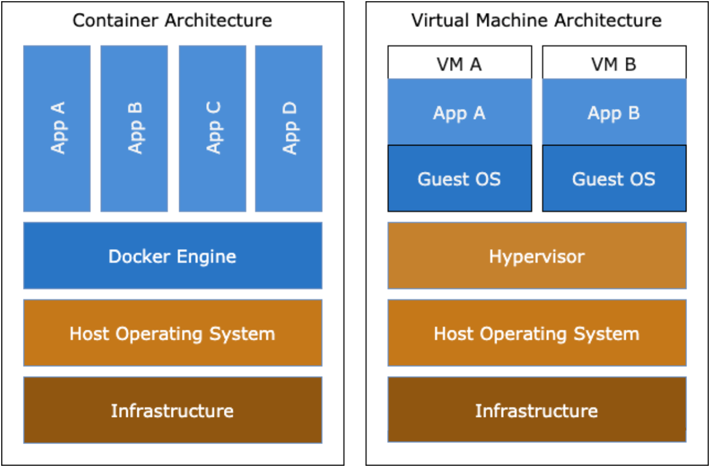

# Docker


# 写在最前

## Docker 解决了什么问题？
一个伟大产品的诞生，都是因为解决了行业中的一个痛点，Docker 解决的是 运行环境和配置问题 + 部署的问题

项目说明： 开发了一个项目，使用语言 vue + python 进行前台、中后台开发，数据库使用mysql，web服务器使用 nginx。 
开发在本地开发完成，会把项目打包发给送测试人员，测试人员把环境部署一遍，大概会有如下步骤：
  1. 安装python及相关依赖；
  2. 安装和配置数据库；
  3. 安装和配置vue环境；
  4. 安装和配置nginx；
  5. 根据当前环境信息，修改 前台、中台配置文件；
  6. 启动所有服务；
  7. 当有新的版本时，会重新部署前台 或者 中后台的程序；
由于开发环境和测试环境的差异，还会有各种其它问题需要解决。

Docker的出现就是解决了这个问题，以前的开发只提供代码和分支 -> 提供Docker镜像。
比如上面这个例子，最终可以可供两个Docker镜像，一个前端镜像 + 一个中后台镜像。
+ 前端镜像：nginx + vue程序 + 启动命令；
+ 中后台镜像：python环境 + 依赖 + python程序 + 启动命令;
测试人员/运维人员只需要知道 前端镜像 和 中后台镜像的 信息，通过一个Docker命令就可以部署完成，因为Docker的一致性和可移植性。

<b>Docker的主要目标是"Build,Ship and Run any App,Anywhere"，构建，运输，处处运行。</b>


## 一个最简单的例子
```bash
# Docker run -d -p 80:80 nginx
# Docker run -d -p 80:80 nginx:latest
```


# Docker介绍

## Docker是什么？
Docker是一种开源的容器化平台，它可以让开发者将应用程序及其所有依赖项打包成一个可移植的容器，以便在不同的计算机、操作系统和云服务上运行。Docker容器是轻量级、可移植、自包含的，具有高度可扩展性和可定制性，这使得Docker成为现代应用程序开发和部署的重要工具。

## Docker的架构

如上图所示，传统的虚拟机的虚拟化在操作系统之上有一层Hypervisor层，虚拟机运行其上，虚拟机里面还许哟啊再运行一个操作系统，而Docker Engine是位于操作系统之上的一层虚拟化，App直接运行再Docker Engine之上，对比传统的虚拟机的形式，其更加轻量，对系统资源的消耗更少，管理也更加简单。

Docker分为两部分：客户端和服务器。
+ Docker客户端是一个命令行工具，开发者可以在本地电脑上使用该工具构建、管理和部署Docker容器。
+ Docker服务器是Docker的主要组件，负责管理Docker镜像和容器。Docker服务器由多个组件组成，包括Docker守护进程、Docker REST API、Docker图形用户界面等。

## Docker的概念
DOcker包括三个基本概念：
+ 镜像（Image）：Docker容器运行时的只读模板，包含了一个完整的Docker容器所需的所有文件和配置。Docker镜像可以看作是Docker容器的“模板”，每个Docker容器都是由一个或多个Docker镜像构建而成的。
+ 容器（Container）：Docker镜像的运行实例，它是一个独立运行的、可移植的软件包，包含了应用程序及其所有依赖项和运行环境。Docker容器可以在不同的平台和环境中运行，而不受底层操作系统的影响。
+ 仓库（Repository）：用来存储和分享Docker镜像的地方，类似于代码仓库。Docker仓库可以分为两种类型：公共仓库和私有仓库。Docker Hub是最大的公共Docker仓库，开发者可以免费下载和使用。私有Docker仓库需要自己搭建，用故意内部应用程序的部署和共享。


# Docker安装部署
略

# Docker镜像
## Docker镜像介绍
Docker镜像是Docker容器的基础，是一个轻量级的、可执行的独立软件包，其中包含了运行特定应用程序所需的所有文件、库和配置。每个Docker镜像都是只读的，可以根据它来创建一个或多个Docker容器。

Docker镜像由多个镜像层组成，每个镜像层都包含文件系统的一部分。每个镜像层都可以由Dockerfile中的一个命令来创建，并且可以重复使用在不同的Docker镜像中。当需要构建一个新的镜像时，可以从已有的镜像中继承一些层，然后添加一些新的层。


Docker镜像可以从Docker Hub上下载，也可以从Dockerfile构建而来。在Dockerfile中，可以使用各种命令来构建Docker镜像，例如COPY、ADD、RUN、ENV等。可以使用Dockerfile构建自己的镜像，也可以在Docker Hub上分享自己的镜像。


## Docker镜像构建
Docker镜像的构建通常通过Dockerfile来实现。Dockerfile是一个文本文件，包含了一系列指令，用于描述Docker镜像的构建过程。通常的构建过程是：

从基础镜像开始构建
运行一些命令，如安装软件、复制文件、设置环境变量等
将构建好的镜像保存到本地或上传到Docker仓库 

一个Dockerfile示例，以刚才的中后台为例（一个Python程序）：
```docker
FROM ubuntu:latest
RUN apt-get update
RUN apt-get install -y python3 python3-pip
COPY . /app
WORKDIR /app
RUN pip3 install -r requirements.txt
CMD ["python3", "app.py"]
```
使用以下命令可以根据Dockerfile构建镜像：
```docker
docker build -t <image-name> .
docker build -t mike-qetools-python .
```
其中，-t选项指定了镜像的名称和标签，"."表示使用当前目录作为构建上下文。

## DOcker镜像分发
```docker
docker login
docker tag <image-name> <docker-id>/<image-name>:<tag>
docker push <docker-id>/<image-name>:<tag>
```

# Docker 图

## Docker event state


## Docker 状态转换图


## Docker 网络


# Docker 命令

## 启动Docker并发布web服务
```bash
# Docker run --name myweb --rm -p 80 nginx
```

```bash
此时可通过两种方式访问
# curl Dockerip:80 
# curl hostip:32769 
host 端口通过以下命令查看
# iptables -t nat -vnL
# Docker port myweb

# Docker run --name myweb --rm -p 80:80 nginx //绑定宿主机的80端口
# Docker run --name myweb --rm -p 2.2.2.2:80:80 nginx //绑定宿主机的固定IP的80端口

# Docker kill myweb

joined container
1. 两个container共享网络
# Docker run --name b1 -it --rm busybox
# Docker run --name b2 --network container:b1 -it --rm busybox

2. container共享host网络
# Docker run --name b3 --network host -it --rm busybox


Docker存储卷
只有最上一层是“读写”
# Docker run -it --name bbox1 -v /data:/data busybox

Dockerfile
# echo ${NAME:-tom} // if NAME not set, 输出tom
# echo ${NAME:+tm} // if NAME set, 输出tom, if NAME not set, 输出空

# cat Dockerfile
# Description: test image
FROM busybox: latest
LABEL maintainer="Mike <mike@qq.com>"

ENV WEB_DOC_ROOT="/data/web/html/"
RUN mkdir $WEB_DOC_ROOT && \
echo 'http server' > ${WEB_DOC_ROOT}/index.html
CMD /bin/httpd -f -h ${WEB_DOC_ROOT}
CMD ["/bin/sh", "-c", "/bin/httpd", "-f", "-h ${WEB_DOC_ROOT}"] // 发现container是exited状态
ENTRYPOINT /bin/httpd -f -h ${WEB_DOC_ROOT}

# Docker build -t tinyhttpd:v0.2-1 ./
# Docker run --name myweb1 --rm tinyhttpd:v0.2-1
# Docker run --name myweb1 --rm -it tinyhttpd:v0.2-1 /bin/sh
# Docker exec -it myweb1 /bin/sh
# Docker kill myweb1

# COPY 用于从Docker主机复制文件至创建的新映像文件
COPY index.html /data/web/html # copy 单个文件
COPY yum.repos.d /etc/yum.repos.d/ # copy目录下的所有内容
# ADD类似COPY指令，但支持TAR文件（会自动展开）和URL路径
# ADD http://nginx.org/download/nginx-1.15.2.tar.gz /usr/local/src/ # 不会解压
ADD nginx-1.15.2-tar.gz /usr/local/src/ # 会解压
# WORKDIR 指定工作目录，可多次设置
# VOLUME 在image中创建一个挂载点目录，以挂载Docker host上的卷或其他容器上的卷
VOLUME /data/mysql
# EXPOSE 用于为容器打开指定要监听的端口
EXPOSE 80/tcp
HEALTHCHECK --start-preiod=3s CMD wget -O - -q http://localhost:80/


# CMD 启动时运行的命令，仅最后一个会生效
# CMD <command> 或
# CMD ["<executable>", "<param1>", "<param2>"]
# CMD ["<param1>", "<param2>"]

# ENTRYPOINT
  类似CMD指令，指定默认运行程序
与CMD不同，由ENTRYPOINT启动的程序不会被 Docker run 命令行指定的参数覆盖

CMD 和 ENTRYPOINT同时存在
  CMD的值会当成参数传给ENTRYPOINT，run指定的command会覆盖 CMD定义的值


技巧：
1. 快速查看container内文件，运行后删除
# Docker run --name tinyweb1 --rm tinyhttpd:v1.0 ls /usr/local/src/
2. 启动web服务，运行后删除
# Docker run --name tinyweb1 --rm tinyhttpd:v1.1 /bin/httpd -f -h /data/web/html/


# Docker images
# Docker rmi // 删除镜像
# Docker rm // 删除容器

容器操作
# Docker attach // 连接正在运行的容器
# Docker inspect // 查看镜像和容器的详细信息
# Docker ps // 显示正在运行的容器的信息
# Docker commit // 将一个容器固化为一个新的镜像

# Docker events // 查看Docker的系统日志信息
# Docker history [OPTIONS] IMAGE // 查看Docker的系统日志信息
# Docker logs [OPTIONS] CONTAINER // 查看Docker的系统日志信息


# Docker cp // Docker cp 容器名：容器中要拷贝的文件名及其路径 要拷贝到宿主机里面对应的路径

a) 从容器拷贝文件到宿主机
将容器：mycontainer 中路径：/opt/testnew/ 下的文件：file.txt 拷贝到宿主机：/opt/test/ 路径下，在宿主机中执行命令如下：
$ Docker cp mycontainer：/opt/testnew/file.txt /opt/test/
b) 从宿主机拷贝文件到容器
将宿主机中路径：/opt/test/ 下的文件：file.txt拷贝到容器：mycontainer 的：/opt/testnew/ 路径下，同样还是在宿主机中执行命令如下：
$ Docker cp /opt/test/file.txt mycontainer：/opt/testnew/

# Docker top 9b40a74ceb82 // 查看容器进程

# Docker attach xxxxxx // container重启后再次连接container


# Docker 核心原理解读
内核知识: namespace 资源隔离
  Mount
 UTS
 USER
 PID
 IPC
 Network
cgroups (control groups) 限制/记录任务组所使用的物理资源（包括CPU、Memor、IO等）
Docker镜像 // Docker镜像是Docker容器的静态视角、Docker容器是Docker镜像的运行状态


# vi Dockerfile
FROM ubuntu:15.04
COPY . /app
RUN make /app
CMD python /app/app.py
```

# Dockers 面试题
## 1. Dockerfile 中 RUN, CMD, ENTRYPOINT 的区别
```
RUN 指令：用于指定 Docker build 过程中要运行的命令。
CMD 指令：类似于 RUN 指令，用于运行程序，但二者运行的时间点不同；CMD 在Docker run 时运行，而非Docker build;
ENTRYPOINT 指令：类似于 CMD 指令，但其不会被 Docker run 的命令行参数指定的指令所覆盖，而且这些命令行参数会被当作参数送给ENTRYPOINT 指令指定的程序
```

## 2. Dockerfile 常用指令
```
FROM：我们使用FROM为后续指令设置基本镜像。在每个有效的Dockerfile中，FROM是第一条指令。
LABEL：我们使用LABEL按照项目，模块，许可等组织我们的镜像。我们也可以使用LABEL来帮助实现自动化。在LABEL中，我们指定一个键值对，以后可用于以编程方式处理Dockerfile。
RUN：我们使用RUN命令在当前镜像之上的新图层中执行任何指令。使用每个RUN命令，我们在镜像顶部添加一些内容，并在Dockerfile的后续步骤中使用它。
CMD：我们使用CMD命令提供执行容器的默认值。在Dockerfile中，如果我们包含多个CMD命令，则只使用最后一条指令

```