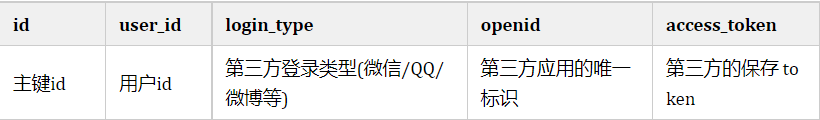

参考链接：https://mp.weixin.qq.com/s/EkjPLF5S-1DeR4m-6N61mQ

# 一、OAuth简介
## 1. OAuth2.0介绍

### 1.1 介绍

OAuth协议：
```
https://www.rfc-editor.org/rfc/rfc6749
```

OAuth（Open Authorization）是一个关于授权（authorization）的开放网络标准，允许用户授权第三方 应用访问他们存储在另外的服务提供者上的信息，而不需要将用户名和密码提供给第三方移动应用或分享他们数据的所有内容。OAuth在全世界得到广泛应用，目前的版本是2.0版。

<b>协议特点</b>
+ 简单：不管是OAuth服务提供者还是应用开发者，都很易于理解与使用；
+ 安全：没有涉及到用户密钥等信息，更安全更灵活；
+ 开发：任何服务提供商都可以实现OAuth，任何软件开发商都可以使用OAuth；

### 1.2 应用场景

+ 原生app授权：app登录请求后台接口，为了安全认证，所有的请求都带token信息，如果登录验证，请求后台数据
+ 前后端分离单页面应用：前后端分离框架，前端请求后台数据，需要进行 oauth2 安全认证
+ 第三方应用授权登录：比如QQ，微博，微信的授权登录


### 1.3 基本概念
OAuth的作用就是让“客户端”安全可空地获取“用户”授权，与“服务提供商”进行交互
+ Resource owner（资源拥有者）：拥有该资源的最终用户，他有访问资源的账号密码；
+ Resource server（资源服务器）：受保护资源所在的服务器，如果请求包含正确的访问令牌，就可以访问受保护的资源；
+ Client（客户端）：请求访问资源的客户端，可以是浏览器、移动设备或者服务器、客户端会携带访问令牌访问资源服务器上的资源；
+ Authorization server（认证服务器）：负责认证客户端身份的服务器，如果客户端认证通过，会给客户端发放访问资源服务器的令牌。

### 1.4 优缺点

<b>有点</b>
+ 更安全，客户端不接触用户密码，服务器端更易集中保护
+ 广泛传播并被持续采用
+ 短寿命和封装的token
+ 资源服务器和授权服务器解耦
+ 集中式授权，简化客户端
+ HTTP/JSON 友好，易于请求和传递 token
+ 考虑多种客户端结构场景
+ 客户可以具有不同的信任级别

<b>缺点</b>
+ 协议框架太宽泛，造成各种实现的兼容性和互操作性差
+ 不是一个认证协议，本身并不能告诉你任何用户信息

## 2. OAuth授权模式

### 2.1 四种授权模式
不管哪一种授权方式，第三方应用申请令牌之前，都必须先到系统备案，说明自己的身份，然后会拿到两个身份识别码：客户端ID（client ID）和客户端密钥（client secret）。这是为了防止令牌被滥用，没有备案过的第三方应用，是不会拿到令牌的。

+ <font color=blue>Authorization Code（授权码模式）</font>：正宗的 OAuth2 的授权模式，客户端先将用户导向认证服务器，认证用户成功后获取授权码，然后进行授权，最后根据授权码访问令牌；
+ <font color=blue>Implicit（隐藏式）</font>：和授权码模式相比，取消了获取授权码的过程，直接获取访问令牌；
+ <font color=blue>Password（密码模式）</font>：客户端直接向用户获取用户名和密码，之后向认证服务器获取访问令牌；
+ <font color=blue>Client Credentials（客户端凭证模式）</font>：客户端直接通过客户端认证（比如 client_id 和 client_secret）从认证服务器获取访问令牌。

一般来说，授权码模式和密码模式是两种常用的授权模式

### 2.2 授权码模式
指应用先申请一个授权码，然后再用这个授权码获取令牌
流程：
+ 客户端将用户导向认证服务器的授权页面；
+ 用户在认证服务器页面登录并授权；
+ 认证服务器返回授权码给客户端；
+ 客户端将授权码传递给客户端所在的后端服务（也可以是自己的认证服务器），由后端服务在后端请求认证服务器获取令牌，并返回给客户端。

### 2.3 密码模式
如何用户新人应用，应用可以直接携带用户的用户名和密码，直接申请令牌
流程：
+ 客户端要求用户提供用户名和密码；
+ 客户端携带用户名和密码，访问授权服务器；
+ 授权服务器验证用户身份之后，直接返回令牌。

# 二、三方授权登录
## 1. 需求介绍
自研应用需要扩展时，绕不开的就是集成其他社交软件的第三方登录，比如微信、QQ、微博、Githu等等，而这用到的模式属于OAuth的授权码方式授权，下面我就介绍几种三方授权登录教程，同事给与数据库扩展设计思路

## 2. 第三方授权登录数据库设计
第三方授权登录的时候，第三方的用户信息是存数据库原有的user表还是新建一张表呢？答案得看具体项目。三方授权登录之后，第三方用户信息一般都会返回用户唯一的标志 <font color=blue>openid</font> 或者 <font color=blue>unionid</font> 或者id，具体是什么得看第三方，比如github是id

### 2.1 直接用过注册的方式保存到数据库
如何网站没有注册功能，直接用过第三方授权登录，授权成功之后，可以直接把第三方的用户信息注册保存到自己数据库的 user 表里面。典型的例子就是微信公众号的授权登录

如果网站由注册功能的，也可以通过第三方授权登录，授权成功之后，也可以直接把第三方的用户信息注册保存到自己数据库的 user 表里面（但是密码是后端自动生成的，用户也不知道，只能用第三方授权登录），这样子的四三方的用户和原生注册的用户信息都在同一张表了，这种情况得看自己项目的具体情况。

### 2.2 增加映射表
现实中很多网站都有多种账户登陆方式，比如可以用网站的注册 id 登录，还可以用手机登录，可以用 QQ 登录等等。数据库中都是有映射关系，QQ、手机号等都是映射在网站的注册 id 上。保证不管用什么方式登录，只要去查映射关系，发现是映射在网站注册的那个 id 上，就让哪个 id 登录成功。

### 2.3 建立一个 oauth 表

建立一个 oauth 表，一个 id 列，记录对应的用户注册表的 id， 然后你有多少个第三方登录功能你就建立多少列，记录第三方登录接口返回的 openid；第三方登录的时候，通过这个表记录的 openid 获取 id 信息，如果存在通过 id 读取注册表然后用 session 记录相关信息。不存在就转向用户登录/注册界面要用户输入本站注册的账户进行 openid 绑定或者新注册账户信息进行绑定。

## 3. 数据库实战举例
+ 用户表分为用户基础信息表+用户授权信息表；
+ 所有和授权相关，都放在用户信息授权表，用户信息表和用户授权表是一对多的关系

用户基础信息表


用户授权信息表


# 三、Github登录
## 1. 概述
文档：
```
https://docs.github.com/cn/developers/apps/building-oauth-apps/creating-an-oauth-app

```

Github 的 OAuth 授权原理大致如下
+ A网站用户跳转到 Github
+ Github 要求用户登录，然后询问 “A网站要求获得 xx 权限，你是否同意“
+ 用户同意，Github 就会重定向回 A网站，同事发回一个授权码
+ A网站使用授权码，向 GIthub 请求令牌
+ Github 返回令牌
+ A网站使用令牌,向Github请求用户数据


## 2. 应用登记
一个应用要求 OAuth 授权，必须先到对方网站登记，让对方知道是谁在请求，所以要先去 GIthub 登记一下（免费）。Github 的文档
首先访问 Authorized OAuth App，填写登记表进行创建（进入 Github 的 Setting 页面，点击 Developer settings, 选择 OAuth Apps，选择new OAuth App）

注意回调地址要与我们待会写的接口地址匹配，否则会报错，进入应用后就能看见我们应用了，secrets没有的话可以生成，注意保存
+ Client ID
+ Client secrets

## 3. Github 授权登录原理

### 3.1 请求用户的 Github 身份
他会提示用户使用他们可以用于登录和授权您的应用程序的特定账户
```
GET https://github.com/login/oauth/authorize
```


### 3.2 用户被 Github 重定向回站点
如果用户接受您的请求，Github 将重定向回您的站点，其中包含一个临时code的代码参数以及您在上一步中提供的state参数状态。临时代码将在10分钟后过期。如果状态不匹配，在第三方创建了请求，您应该中止该过程。

也就是重回到我们的站点，也就是发送了 <font color=blue> http://localhost:8080/oauth/githubCallback(自定义) </font>，并且携带了code将此交换code为访问令牌<font color=blue>OAUTH-TOKEN</font> 
```
POST https://github.com/login/oauth/access_token
```


### 3.3 使用访问令牌访问API
访问令牌允许代表用户向 API 发出请求，获取用户的基本信息
```
Authorization: token OAUTH-TOKEN
GET https://api.github.com/user
```

## 4. 代码实战

### 4.1 配置环境

<font color=blue></font> <font color=blue></font>

