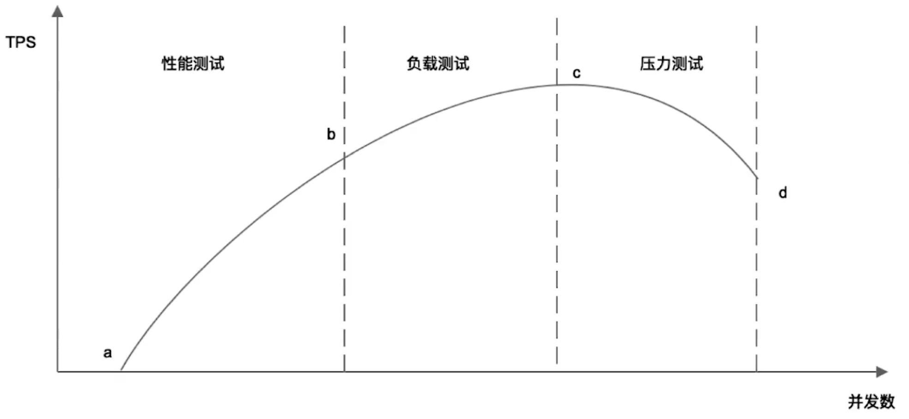
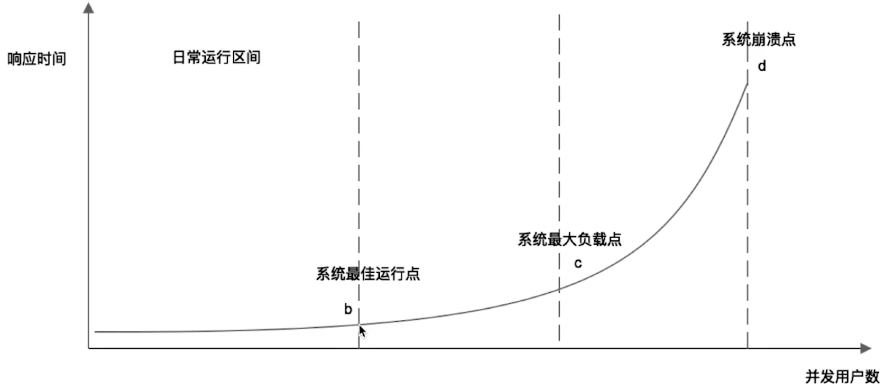

# 性能测试曲线

## 性能曲线
性能测试的概念：以系统设计初期的性能指标为预期目标，对系统不断施加压力，验证系统在资源可接受范围内，是否能达到性能预期。

曲线特征：会先后经历性能测试， 负载测试 和 压力测试 三个阶段，也就是连续的三个阶段。


吞吐量：单位时间内系统处理的请求的数量，体现系统的处理能力。对于网站，可以用“请求数/秒” 或是“页面数/秒” 来衡量，也可以用“访问人数/天” 或是 “处理的业务数/小时”等来衡量。

TPS(每秒事务数)也是吞吐量的一个指标
**吞吐量 = (1000/响应时间ms) ∗ 并发数**

a-b 阶段，随着并发数的增加 TPS 在线性增长。
b-c 阶段，b 点的特征是 b 开始 TPS 上升曲线相对平缓了，负载的最高点就是 c 点。
c-d 阶段，c 点是 TPS 的最高点，后面就 TPS 慢慢下降了，原因是并发数越来越多，大家都在等待和抢资源，处理不完了，虽然并发数在增加，但响应时间在增加，所以 tps 反而是下降的。
一直降到某个点，系统的某项资源耗尽，整个服务就挂掉了。 

      性能曲线带来的意义是，我们根据运营或产品提出的业务需求，预估出系统是否可以撑起业务的需要，通过连续的性能、负载和压力测试可以得知我们系统能承受的最大并发数儿，以便于在合理的成本下能够有效的支撑业务的需要，结合成本系统是可以在 b 点的左边或者是右边儿的。
      在系统快要到 C 点的时候可以提前获悉，为系统的及时升级做准备。

## 响应时间与并发用户数的图

 整个曲线和上面的曲线是可以对应上的

# web 性能压测工具
```
  写一个 web 性能压测工具
  输入参数：URL，请求总次数，并发数。
  输出参数：平均响应时间，95% 响应时间。
  用这个测试工具以 10 并发、100 次请求压测 www.baidu.com
```

```
func httpGet(url string) {
	resp, err := http.Get(url)
	if err != nil {
		fmt.Printf("err=%v", err.Error())
	}
	defer resp.Body.Close()

	_, err = ioutil.ReadAll(resp.Body)
	if err != nil {
		fmt.Printf("err=%v", err.Error())
	}
	//fmt.Println("request done", string(body))
}

func testBingfa(url string, count int) float32 {
	sTime := time.Now().Unix()
	var wg sync.WaitGroup
	wg.Add(count)
	for i := 0; i < count; i++ {
		go func() {
			httpGet(url)
			wg.Done()
		}()
	}
	wg.Wait()
	eTime := time.Now().Unix()
	tDiff := (int)(eTime - sTime)
	fmt.Printf("tDiff=%v \n", tDiff)
	tps := (float32)(count / tDiff)
	return tps
}

func main() {
	//TPS（transaction per second）代表每秒执行的事务数量
	tps := testBingfa("http://www.baidu.com", 300)
	fmt.Printf("TPS=%v \n", tps)
}
```