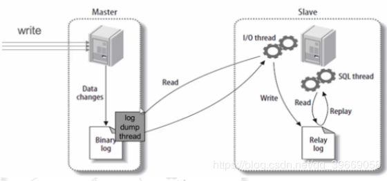
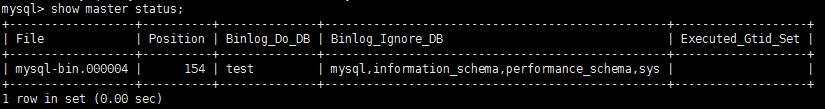
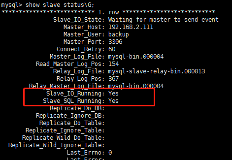
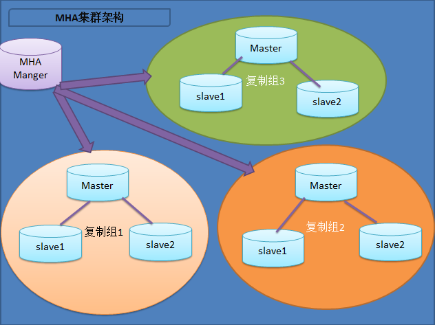

# 基本概念

## 事务
```
transaction: 多个操作被当作一个整体对待
ACID: 
    A: 原子性
    C: 一致性（两个银行账户汇款）
    I: 隔离性（两个事务毫不相干）
    D: 持久性
```
脏数据：中间状态的数据（事务未完成，数据就被引用）

## 范式
```
1NF: 无重复的列，每一列都是不可分割的基本数据项，同一列中不能有多个值；
2NF: 属性完全依赖于主键，
3NF: 属性不依赖于其它非主属性
```

## 约束
```
约束: constraint, 表中的数据要遵守的限制
  主键： 一个或多个字段的组合，填入的数据必须能在本表中唯一表示本行；必须提供数据，即NOT NULL，一个表只能有一个
唯一键：一个或多个字段的组合，填入的数据必须能在本表中唯一标识本行；允许为NULL，一个表可以存在多个
外键：一个表中的某字段可填入的数据取决于另一个表的主键或唯一键已有的数据
检查：字段值在一定范围内
```

## 索引
```
索引：将表中的一个或多个字段中的数据复制一份另存，并且此些需要按特定次序排序存储
关系运算
选择：挑选出符合条件的行
投影：挑选出需要的字段
连接：表间字段的关联
```

数据模型
数据抽象
关系模型的分类

## MySQL: 单进程-多线程
```
# mysql_secure_installation //安装后的安全配置
```


# MySQL主从

## 主从复制原理
```
当 master 主服务器上的数据发生改变时，则将其改变写入二进制日志文件中
salve 从服务器会在一定时间间隔内对 master 主服务器上的二进制日志进行探测，探测其是否发生过改变
如果探测到 master 主服务器的二进制日志发生了改变，则开始一个 I/O Thread 请求master 二进制日志
同时 master 主服务器为每个 I/O Thread 启动一个 dump Thread，用于向其发送二进制日志
slave 从服务器将接收到的二进制事件保存至自己本地的中继日志文件中
salve 从服务器将启动 SQL Thread 从中继日志中读取二进制日志，在本地重放，使得其数据和主服务器保持一致
最后 I/O Thread 和 SQL Thread 将进入睡眠状态，等待下一次被唤醒；
```

## MySQL 主从复制原理图



## 实现MySQL主从复制需要进行的配置： 
主服务器： 
1) 开启二进制日志 
2) 配置唯一的server-id 
3) 获得master二进制日志文件名及位置 
4) 创建一个用于slave和master通信的用户账号 
从服务器： 
1) 配置唯一的server-id 
2) 使用master分配的用户账号读取master二进制日志 
3) 启用slave服务

```
环境：
主数据库： 192.168.2.111
从数据库： 192.168.2.112
```

#### master配置
```bash
1. 修改my.cnf
# vi /etc/my.cnf
# 启用二进制日志
log-bin=mysql-bin
# 服务器唯一ID，一般取IP最后一段
server-id=111
# 要给从机同步的库
binlog-do-db=test
# 不给从机同步的库(多个写多行)
binlog-ignore-db=mysql
binlog-ignore-db=information_schema
binlog-ignore-db=performance_schema
binlog-ignore-db=sys
# 自动清理 7 天前的log文件,可根据需要修改
expire_logs_days=7

2. 重启mysql，创建用于同步的用户账号
> CREATE USER 'repl'@'192.168.2.111' IDENTIFIED BY 'password'; #创建用户 
> GRANT REPLICATION SLAVE ON *.* TO 'repl'@'192.168.2.111'; #分配权限 
> flush privileges; #刷新权限

3. 查看master状态，记录二进制文件名(mysql-bin.000004)和位置(154):
```



#### 从服务器修改
```bash
1. 修改配置文件
# vi /etc/my.cnf
# 服务器唯一ID，一般取IP最后一段
server-id=112

2. 重启mysql，打开mysql会话，执行同步SQL语句(需要主服务器主机名，登陆凭据，二进制文件的名称和位置)：
> CHANGE MASTER TO 
-> MASTER_HOST='192.168.2.111', 
-> MASTER_USER='rep1', 
-> MASTER_PASSWORD='password', 
-> MASTER_LOG_FILE='mysql-bin.000004', 
-> MASTER_LOG_POS=154;

3. 启动slave同步进程 
> start slave;

4. 查看slave状态
```



## MHA
参考链接：https://www.cnblogs.com/gomysql/p/3675429.html

MHA（Master High Availability）目前在MySQL高可用方面是一个相对成熟的解决方案，它由日本DeNA公司youshimaton（现就职于Facebook公司）开发，是一套优秀的作为MySQL高可用性环境下故障切换和主从提升的高可用软件。在MySQL故障切换过程中，MHA能做到在0~30秒之内自动完成数据库的故障切换操作，并且在进行故障切换的过程中，MHA能在最大程度上保证数据的一致性，以达到真正意义上的高可用。
该软件由两部分组成：MHA Manager（管理节点）和MHA Node（数据节点）。MHA Manager可以单独部署在一台独立的机器上管理多个master-slave集群，也可以部署在一台slave节点上。MHA Node运行在每台MySQL服务器上，MHA Manager会定时探测集群中的master节点，当master出现故障时，它可以自动将最新数据的slave提升为新的master，然后将所有其他的slave重新指向新的master。整个故障转移过程对应用程序完全透明。
在MHA自动故障切换过程中，MHA试图从宕机的主服务器上保存二进制日志，最大程度的保证数据的不丢失，但这并不总是可行的。例如，如果主服务器硬件故障或无法通过ssh访问，MHA没法保存二进制日志，只进行故障转移而丢失了最新的数据。使用MySQL 5.5的半同步复制，可以大大降低数据丢失的风险。MHA可以与半同步复制结合起来。如果只有一个slave已经收到了最新的二进制日志，MHA可以将最新的二进制日志应用于其他所有的slave服务器上，因此可以保证所有节点的数据一致性。



（1）从宕机崩溃的master保存二进制日志事件（binlog events）; 
（2）识别含有最新更新的slave； 
（3）应用差异的中继日志（relay log）到其他的slave； 
（4）应用从master保存的二进制日志事件（binlog events）； 
（5）提升一个slave为新的master； 
（6）使其他的slave连接新的master进行复制；


# NoteBook

## 慢查询: slowlog 分析工具
```bash
/etc/mysql/my.cnf 
[mysqld] 
log-slow-queries
```
在 my.cnf 配置文件中增加上述配置项并重启 mysql 服务，这时 mysql 慢查询功能生效。慢查询 日志将写入参数 DATADIR （数据目录：/var/lib/mysql） 指定的路径下，默认文件名是 host_name-slow.log 。 
和错误日志、查询日志一样，慢查询日志记录的格式也是纯文本，可以被直接读取。下例中演示了慢查询日志的设置和读取过程。

1）首先查询一下 long_query_time 的值 。 
```sql
mysql> show variables like 'long%';
```

2） 设置方法

```sql
mysql> set long_query_time=1; //重启会失效
```

```bash
#cat my.cnf
log-slow-queries=/var/lib/mysql/slowquery.log 
long_query_time=1
```
mysqldumpslow常用参数
例：显示执行时间最长的前两个
```bash
# mysqldumpslow -s t -t 2 /opt/mysql/data/slowquery.log
```
-s 后面接下面的参数表示 mysqldumpslow 结果显示的顺序！
c query执行的次数 
t sql执行的时间
l lock锁表的时间 
r sql返回的行数 
ac,at,al,ar,表示倒序排列 
-t,是top n,即为返回前面n条数据。 
-g,后边可以写一个正则匹配模式,大小写不敏感 

## MyISAM和InnoDB:
1. 只写binlog
2 又写binlog又写redo又写undo
多引擎，为了统一都写binlog
两个线程: 
一个IO线程负责从master去拿，写到relaylog，
另一个线程sql线程负责从relay log读取然后执行

检查master和slave数据时候一致:
1. 对外不提供服务时: 
主从checksum table 表名
缺点: 不知道哪行
2. 工具(可不停业务，可更新数据)
pt-table-checksum
pt-table-sync

大表加一列:
工具 : pt-osc(online schema change)
原理: 利用触发器，在主库上建立临时表(包含临时表)，同步完以后表改名

监控哪些信息:
cpu 内存 IO 连接数
> show processlist;

sleep怎么产生:
> show processlist 查看连接sleep时间
连接上mysql之后sql没有处于运行的状态，就是显示sleep
如果超过mysql的超时时间，就会被强制断开，程序会显示lmysql server has gone away.


# MySQL常用命令
```sql
> mysql -u用户名 -p用户密码
> grant 权限 on 数据库.* to 用户名@登录主机 identified by "密码"
> grant select,insert,update,delete on *.* to user1@localhost Identified by "password1";

> \s # 查看信息
> select * from user\G; 
> select user(); // 查看所有用户
> udpate mysql.user set password=password("xxx") where user='root';

> CREATE database blog; 
> CREATE TABLE blog_user
( name char(15) not null check(name !=''), 
password char(15) not null, 
email varchar(20) not null unique, 
primary key(name) 
) engine=innodb default charset=utf8 auto_increment=1;
> SHOW COLUMNS from blog_user;
> DESCRIBE blog_user;

# 创建临时表
> create temporary table t1(name varchar(10)); 
# 创建表是先判断表是否存在 　　
> create table if not exists students(……);
# 从已经有的表中复制表的结构 　　
> create table table2 select * from table1 where 1<>1;
# 复制表 　　
> create table table2 select * from table1;
# 对表重新命名 　　
> alter table table1 rename as table2;
# 修改列的类型 　　
> alter table table1 modify id int unsigned; //修改列id的类型为int unsigned 　　> alter table table1 change id sid int unsigned;//修改列id的名字为sid，而且把属性修改为int unsigned

# 创建索引 　　
> alter table table1 add index ind_id (id); 　　
> create index ind_id on table1 (id); 　　
> create unique index ind_id on table1 (id); //建立唯一性索引 　　 　　
# 删除索引 　　
> drop index idx_id on table1; 　　
> alter table table1 drop index ind_id;
使用索引的缺点 　　
1)减慢增删改数据的速度； 　　
2）占用磁盘空间； 　　
3）增加查询优化器的负担； 　　
当查询优化器生成执行计划时，会考虑索引，太多的索引会给查询优化器增加工作量，导致无法选择最优的查询方案；

# limit(选出10到20条)<第一个记录集的编号是0> 　　
> select * from students order by id limit 9,10;
# 增加字段

> ALTER table tabelName add column fieldName dateType;

> mysqldump -u root -p123456 --databases dbname > mysql.dbname
> mysqlimport -u root -p123456 < mysql.dbname。


> select now(); 　　 # 查询时间
> select user(); 　 # 查询当前用户
> select version(); 　# 查询数据库版本：
> select database(); # 查询当前使用的数据库：

# 使用procedure analyse() 　　
可以使用procedure analyse()显示最佳类型的建议，使用很简单，在select语句后面加上procedure analyse()就可以了；例如： 　　
> select * from students procedure analyse(); 　　
> select * from students procedure analyse(16,256); 　　
第二条语句要求procedure analyse()不要建议含有多于16个值，或者含有多于256字节的enum类型，如果没有限制，输出可能会很长；
```